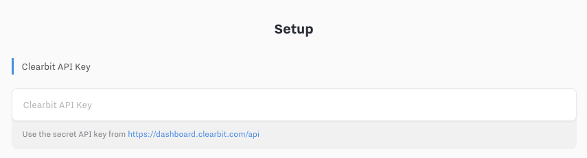
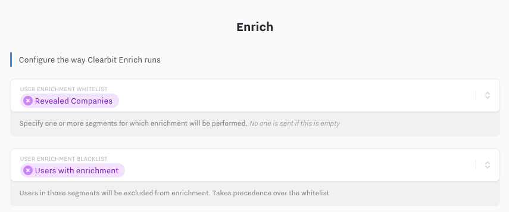
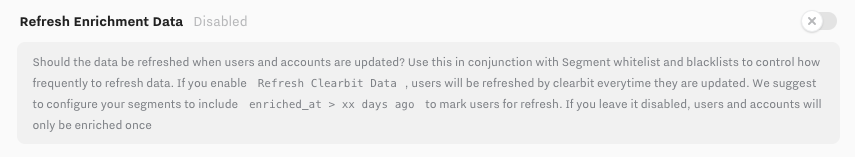
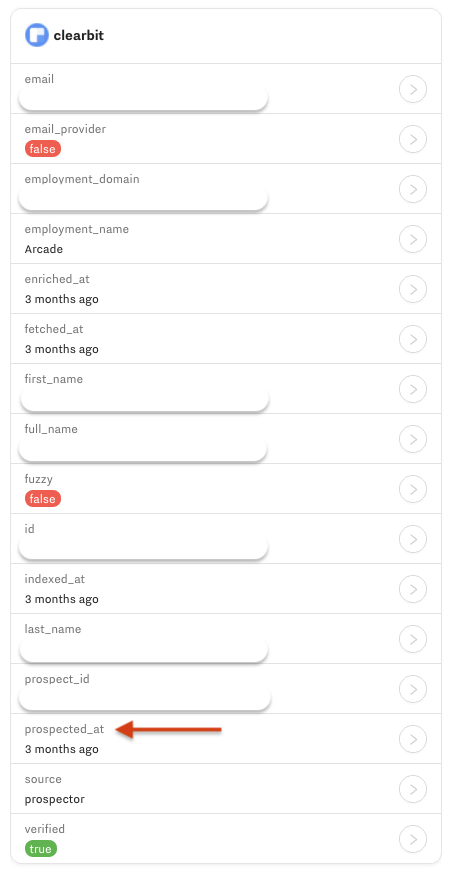
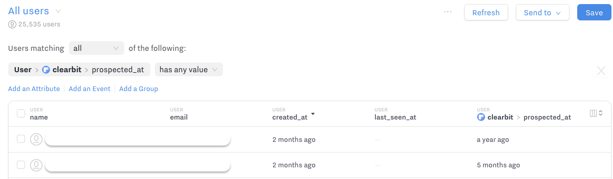

# Hull Clearbit Connector

The Clearbit Connector enables sales and marketing teams to enrich customer profiles, reveal anonymous website traffic, find the ideal buyer and discover new accounts.

## Getting Started

1. From your Connectors list in the dashboard, click `Add Connector`.
2. Choose `Clearbit`.
3. Confirm the installation by clicking `Install`.
4. Click on `Settings` and fill in the "Clearbit API Key" field.
    As described in this field, you can go to https://dashboard.clearbit.com/api in order to find this key.
    If you are not sure which key to use, see [Finding Your Clearbit API Key](#Finding-Your-Clearbit-API-Key) for details.
    
    

5. Complete the configuration of the Clearbit connector (see [Features](#Features) to learn how to configure the various solutions).

## Features

Clearbit [**Enrichment**](#Enrichment) enables your team to transform the email address of a user in Hull into a complete user and company profile with up to 85 data points.

With Clearbit [**Reveal**](#Reveal) you can turn your anonymous website traffic into company profiles to power targeted campaigns and close more named accounts.

Use the [**Prospector**](#Prospector) to grow your pipeline and find the right buyer within a named account; all you need is a domain name. The connector enables your team to automatically send revealed companies back to Clearbit and obtain targeted user profiles, no manual work required.

The Clearbit connector supports to `create users`, `create accounts`, `add traits` and `update traits`.

Here's a summary of all the essential attributes (user and account levels) you have to remember for your setup:

| Account attribute       | User Attribute |
|:-----------------------:|:--------------:|
| enriched_at             | enriched_at    |
| revealed_at             | revealed_at    |
| prospected_account_id   | prospected_at  |
| prospected_users        | /              |

## Finding Your Clearbit API Key

You can find your key in your Clearbit dashboard under the API menu link or by navigating to [https://dashboard.clearbit.com/api](https://dashboard.clearbit.com/api). Clearbit provides two keys, a _secret API key_ and a _publishable API key_. Use the **secret API key** to integrate Hull with Clearbit:

## Enrichment

The Enrichment feature of the connector allows you to complete a users profile with more than 85 data points provided by Clearbit’s API.

**Configure Enrichment**
Select which users are sent to Clearbit Enrich using the User and Account Enrichment whitelist, and exclude those who shouldn't using the User and Account Enrichment Blacklist.
If you want to setup recurring enrichment, you can enable the `Refresh Enrichment Data` option, which will enrich users repeatedly, anytime they match those segments. In this case you should configure your Blacklist to exclude users who have been enriched more recently than a given date, by adding a `clearbit/enriched_at < xx days ago` predicate in the blacklist.

Note that after selecting and saving segments to Enrich, **that segment won't be sent directly** to the Clearbit connector. Instead the connector will wait for one of these entities to receive an update (e.g. Entered a segment).
If you need to immediately synchronize this segment so that the Clearbit connector can reveal it, you can send this segment as a batch from your dashboard.

**How long does it take to enrich users?**
In most cases this process will take no longer than a couple of minutes. In some cases the Clearbit API marks a lookup as pending, which results in a delay of processing for up to an hour.

## Reveal

The Reveal feature of the connector allows you to turn your anonymous website traffic into company profiles to power targeted campaigns and close more named accounts.

For Reveal to work, you need to specify which users will be sent to reveal using the `whitelist` and `blacklist` filters. In any case, we won't send a user to be revealed more than once, and we rely on the presence of `clearbit/revealed_at` to exclude those already revealed users.

When revealed, the user will be attached to an account to which we will append Clearbit data. If an account with the same domain name already exists, the user will be appended to this account.

Reveal provides you a company profile by performing a reverse IP lookup which provides your sales team the account information, but you can go one step further by automating the process to find prospects for this account. More details, see "**When does the Prospector workflow run?**".

**How to enable Anonymous Users for your organization?**
By default, your Hull organization does not store data about anonymous traffic, so you need to enable “Anonymous Users” for your organization.
You can enable anonymous users or check the feature status within your **Organization Settings**.

## Prospector

The Prospector feature of the connector enables you to grow your pipeline and find the right buyer within a named account by passing along the domain name.

The Prospector will search for contacts within named accounts by passing the domain name of the website along. You can define which attribute you want to use as company domain by picking it from the dropdown list.

The Account Prospector whitelist and Blacklist allow you to configure which domains should be prospected. If you want to prospect domains only once, you should build a Prospector Blacklist that includes a condition `clearbit/prospected_at` is empty or `clearbit/prospected_users > n`

If you want to target only accounts that match a certain profile, you can create segments for targeted profiles and restrict the Prospector flow to run only for accounts within those segments.
You can define the maximum number of leads to fetch from Clearbit by adjusting the slider to desired position. This setting will help you to control your costs.

While the general settings control the overall behavior of the connector, you can refine your search by filtering a certain role, seniority, title or any combination of the aforementioned. This will help you to find the people matching your ICP within an account

**When does the Prospector workflow run?**
The Prospector workflow gets triggered exactly once per account, relying on the presence of `clearbit/prospected_at` to exclude accounts from prospection. It will trigger when an account receives an update, such as entering the segment you have whitelisted.

**How do I know if the Prospector workflow has been executed?**
The Clearbit Connector sets the attribute `prospected_at` within the Clearbit attribute group that contains the timestamp when prospector has been executed.

It also increases the account `prospected_users` counter with the number of matches from the last prospection

You can use this attribute in your users list to query all users that have this attribute set or where this attribute is unknown.

**Where are the returned prospects stored?**
Leads or prospects returned from Clearbit are stored as users in Hull. You can identify these users by querying your users list by filtering users with `clearbit/prospected_at` has any value or `clearbit/prospected_account_id` has any value.
Those hull users will be linked to the account you prospected.

## Manually prospecting Users

The Clearbit connector allows you to manually prospect accounts, by clicking on the `Prospector` button in the Connector's Overview tab. From there you can define domain names (you can search for more than one at a time), roles and limits. When searching, the results will be displayed but not saved to Hull. The next step is to select those you wish to import, and click `Import to Hull`.

Beware that due to limitations from the Clearbit API, returned results are counted against your Clearbit quota, even if you don't save them
