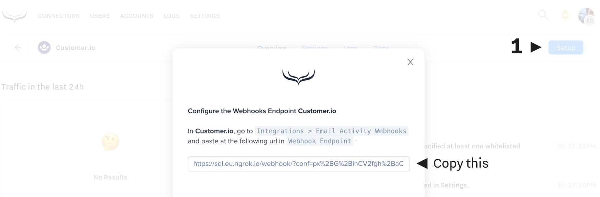
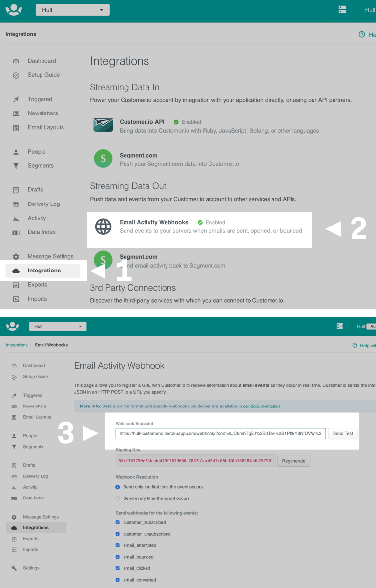
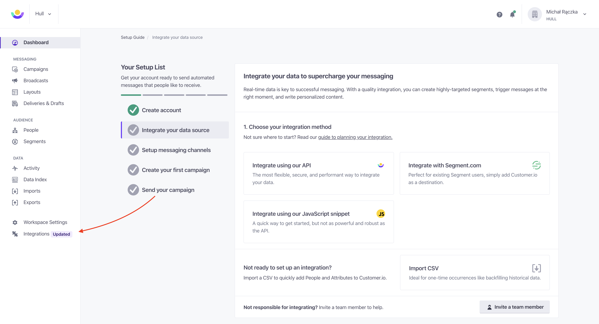
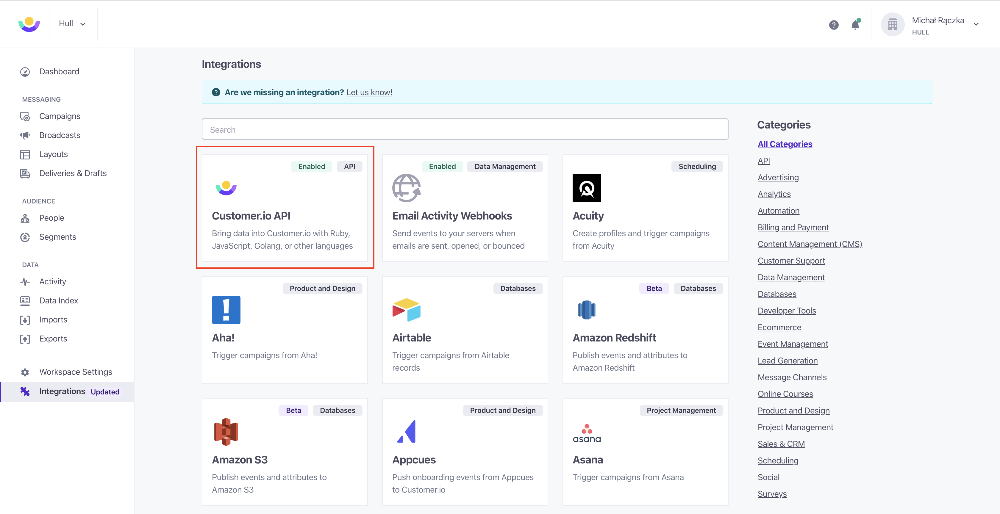
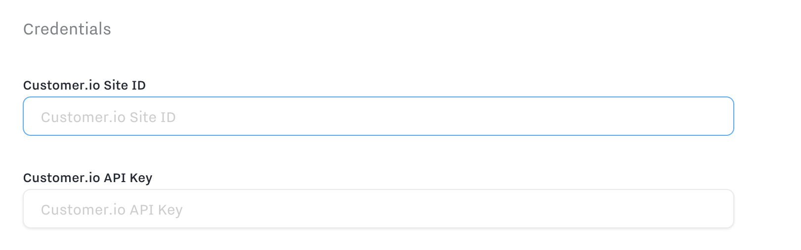
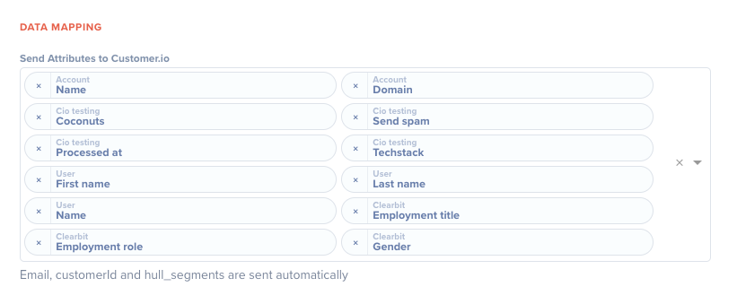
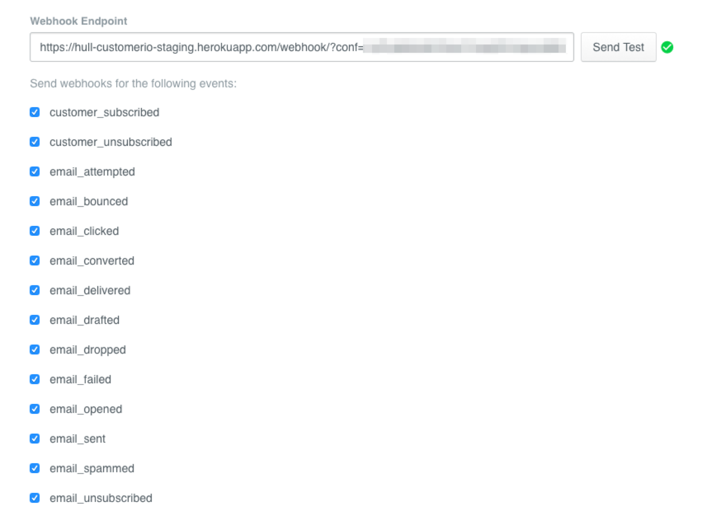

# Customer.io Connector

The Customer.io Connector enables your team to synchronize users from Hull with Customer.io to automate customer lifecycle emails and campaigns.

## Getting Started

### Receiving Email activity from Customer.io
To receive customer activity from Customer.io you need to tell Customer.io to send events to Hull when something happens
Start by opening the `Setup` tab in Hull, and copying the generated Webhook URL

Then go to **Customer.io**
1. Click on "Integrations"
2. Click on "Email Activity Webhooks"
3. Paste the URL you copied in the box. Check all event types below it.
4. Click on the button “Send Test” and save your changes if the symbol indicates success.

### Sending User Profiles and Events to Customer.io
1. Head to the "Customer.io API" section in **Customer.io** credentials, and copy the `Site ID` and `API Key`.

2. In Hull, open the Settings Tab of your Customer.io connector, Scroll down to the “Configuration” and fill in the Credentials

Here you can determine the **whitelisted segments** which a user needs to belong to in order to send it to customer.io. If you don’t specify any segments, no user will be send to customer.io.

You can also determine how to handle when a user leaves a segment. When you **enable user deletion**, the Connector will automatically remove users from customer.io if they no longer belong to any of the whitelisted segments.

Furthermore, you can specify which **events** shall be send to customer.io by selecting the events from the dropdown list.

### Sending Anonymous Events
You can also activate **Anonymous Events**, which is an advanced feature in customer.io. If you are not familiar with this feature, you can read more in Customer.io’s own [documentation](https://learn.customer.io/recipes/anonymous-invite-emails.html).

The most important decision you have to make here is **which user attribute to send as the** `**customerId**` to customer.io which is the unique identifier within customer.io. Our recommendation is to either use the `external_id` if you assign your own identifier to users in Hull or use the Hull `id`.

The last step of the setup is to specify the fields to send from Hull to customer.io:

## Features

The customer.io connector allows you to synchronize users from Hull with persons in customer.io to automate customer lifecycle emails and campaigns. You can also forward events/activities from Hull to customer.io to use this behavior data to trigger powerful workflows to send emails, SMS and more.

You can also feed events related to email activity back from customer.io into Hull to leverage this information in your other connected tools.

The Customer.io Connector supports to `update traits` and `create events`.

## How to obtain your credentials

Navigate to your customer.io dashboard and locate the “Integrations” item on the menu to the left side of your screen. Click on the button “Settings” next to Customer.io API:

Note down the “Site ID” and “API Key” from the following page:

## How to determine which events customer.io sends to Hull

Optionally, You can choose to limit the events Hull will receive from customer.io. The list of all events is available in the customer.io docs under [http://learn.customer.io/developer-documentation/webhooks.html#events](http://learn.customer.io/developer-documentation/webhooks.html#events).

To customize this events, navigate to your customer.io dashboard, select “Integrations” from the menu to the left side of your screen and click the button “Settings” next to Email Activity Webhook:

On the next page, you can select the events you want to receive from the list and save your changes:

