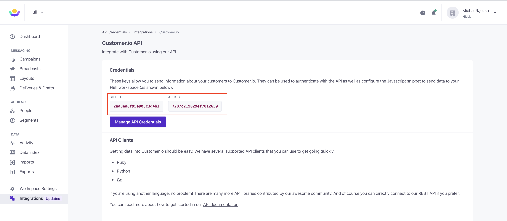
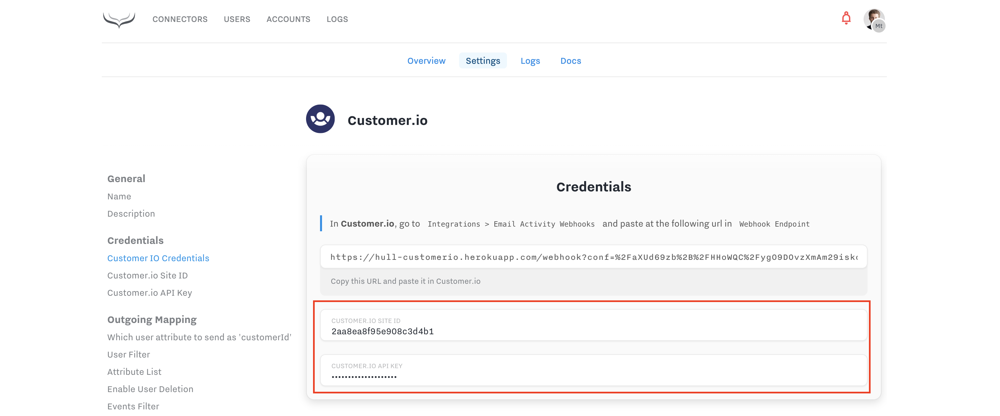
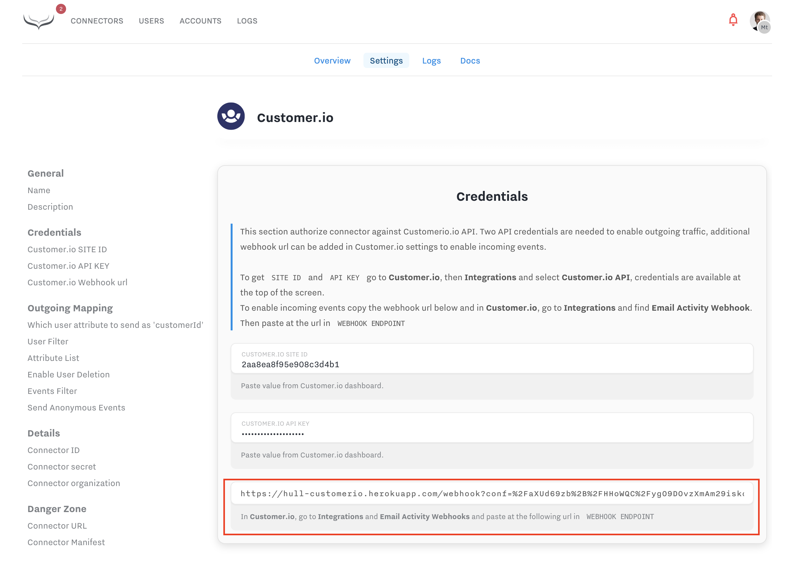
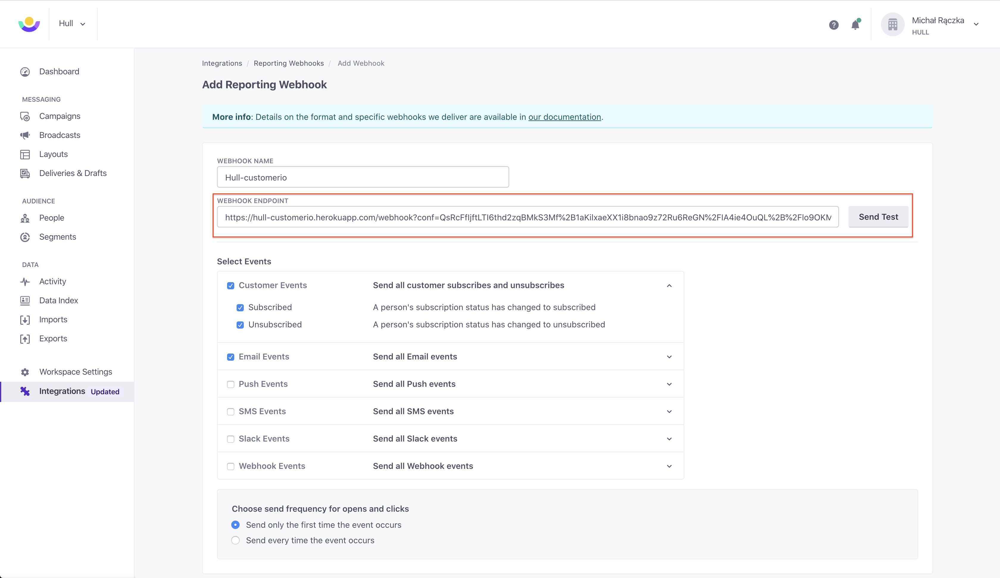
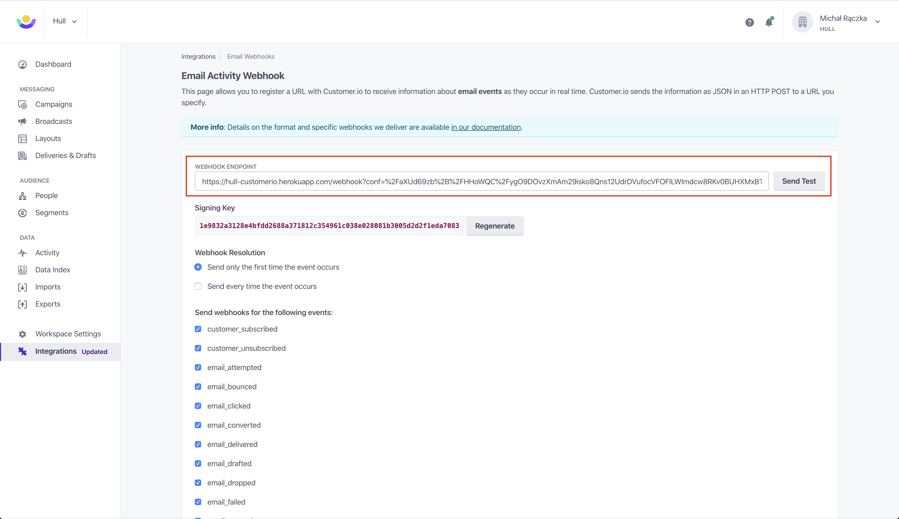
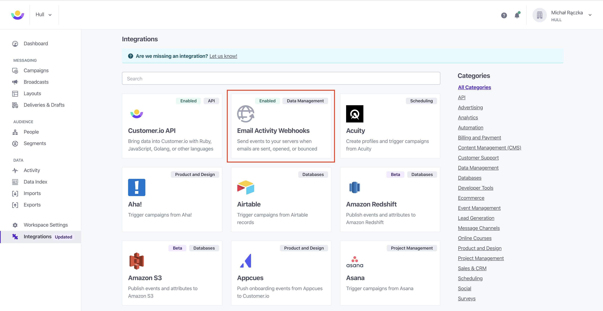
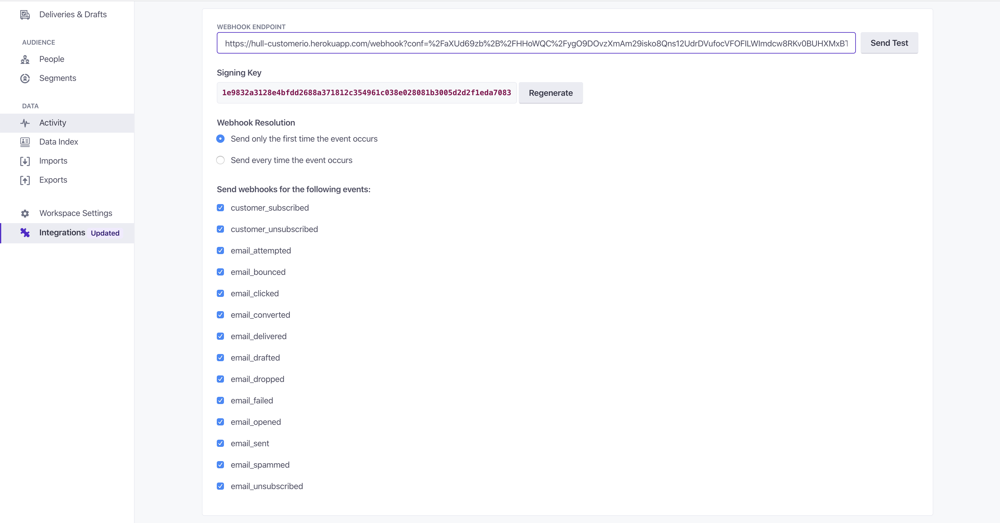

# Customer.io Connector

The Customer.io Connector enables your team to automate customer lifecycle emails and campaigns by synchronizing users from Hull with Customer.io. 
It also has the ability to send email activity events to Hull.

## Features

The Customer.io Connector allows you to:

1. Synchronize users in Hull with persons in Customer.io to automate customer lifecycle emails and campaigns
2. Forward events/activities from Hull to Customer.io to trigger powerful workflows such as sending emails, SMS and more
3. Feed events related to email activity from Customer.io into Hull where you are able leverage this information in your other connected tools.

The Customer.io Connector supports the actions `update traits` and `create events`.

## Getting Started

### Authorize outgoing traffic

1. In **Customer.io** head to **Integrations** and select **Customer.io API** section. At the top of the screen you will find `SITE ID` and `API KEY`.

  

  

  

2. In **Hull**, open the **Settings** tab of your Customer.io connector, scroll down to the **Credentials** section and fill in the `SITE ID` and `API KEY`.

  

That's it! The connector is now ready to send data to Customer.io!

### Receiving Email activity from Customer.io

To receive customer activity from Customer.io you need to tell Customer.io to send events to Hull when something happens.

1. Start by opening the `Settings` tab in Hull, and copying the generated Webhook URL:
  
2. Then go to **Customer.io**.
3. Click on "Integrations".
4. Find and click on "Reporting Webhooks". If you aren't seeing this category, please refer to the [Legacy setup](#\[Legacy\]-Receiving-Email-activity-from-Customer.io) next to this one.
5. Click on "Add Reporting Webhooks". Make sure you don't already have a Hull webhook set-up, as it will count towards your limits in Hull because of duplicated traffic.
5. Paste the URL you copied in the box. Check all "Customer" and "Email" event types below it (support for more events later on).
6. Click on the button “Send Test” and save your changes if the symbol indicates success.
  

### \[Legacy\] Receiving Email activity from Customer.io

If you aren't seeing the "Reporting Webhooks" integration in Customerio, refer to this section instead.
To receive customer activity from Customer.io you need to tell Customer.io to send events to Hull when something happens.

1. Start by opening the `Settings` tab in Hull, and copying the generated Webhook URL:
  
2. Then go to **Customer.io**.
3. Click on "Integrations".
4. Find and click on "Email Activity Webhooks".
5. Paste the URL you copied in the box. Check all event types below it.
6. Click on the button “Send Test” and save your changes if the symbol indicates success.
  

That's it! The connector is now ready to receive data to Customer.io!

## Configuration

When connector is authorized against Customer.io API, it's time to define what data exactly will be send and received from Customer.io.

### Sending Users

Start with Outgoing Mapping section in the settings.

The most important decision you have to make here is **which user attribute to send as the** `**customerId**` to Customer.io which is the unique identifier within Customer.io. Our recommendation is to either use the `external_id` if you assign your own identifier to users in Hull or use the Hull `id`.

To send users to Customer.io, first define which **whitelisted segments** users will need to belong to. If the segments are not specified, users will not be sent to Customer.io.
Second, specify which attributes will be sent from Hull to Customer.io. By default,
the attributes `email`, `customerId` and `hull_segments` (all the segments the user belongs to) will be sent to Customer.io.

> **IMPORTANT**: Please keep in mind that Customer.io API allows to send maximum 30 attributes per API call so bigger number of selected attributes will double the number of API calls and can make the connector slower.

When users leave all whitelisted segments, you have to ability to remove that user from Customer.io. To enable this feature, 
toggle on **enable user deletion** and the connector will automatically remove users from Customer.io if they no longer belong to any of the whitelisted segments. 
Otherwise, if a user leaves all whitelisted segment it will be kept in Customer.io, but will no longer receive updates.

Furthermore, you can specify which **events** will be sent to Customer.io by selecting the events from the dropdown list. By default no events are sent. 
Each outgoing event will create a new activity in Customer.io. For all events except Page View Events (see below), the activity type will be set to "Event" and the 
activity name will have the same name as the Hull event, which allows basic segmentation in Customer.io.

### Sending Page View Events

Customer.io allows you the option to handle Page View Events differently than generic events. 
To begin sending these events to Customer.io, in the connector settings, add the `page` event to whitelisted events list. The connector will then send all future Page View Events to Customer.io 
as activities. Unlike generic events, the type of the activity will be set to "Page" and the name of the activity will be the url of the Page View.
This is aligned with Customer.io [documentation on tracking page views](https://Customer.io/docs/pageviews) and allows you to build more fine grained segments in Customer.io.
The url of the Page View activity will be picked from Hull Event url property, or, if not available, will fall back to the page_url context property. Additionally, a referrer will be added to the Customer.io activity.

### Sending Anonymous Events

You can also activate **Anonymous Events**, which is an advanced feature in Customer.io. If you are not familiar with this feature, please refer to Customer.io’s [documentation](https://Customer.io/docs/anonymous-invite-emails).

## Optional - receiving subset of Customer.io events

You are able to limit the events Hull will receive from Customer.io. The list of all events is available in the Customer.io docs under [https://Customer.io/docs/webhooks#events](https://Customer.io/docs/webhooks#events).

To customize this list, navigate to your Customer.io dashboard, select **Integrations** from the menu on the left, and navigate to **Email Activity Webhook** card:

On the next page, you can select the events you want to receive from the list and save your changes:

