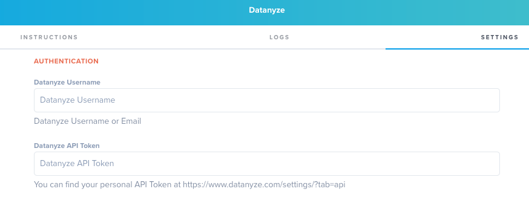
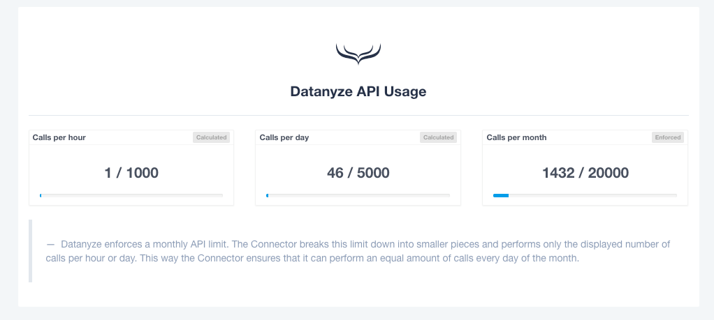
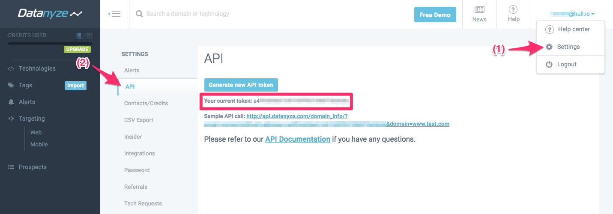
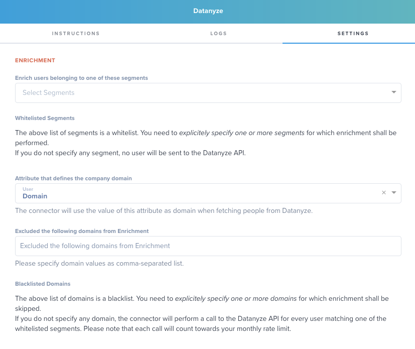
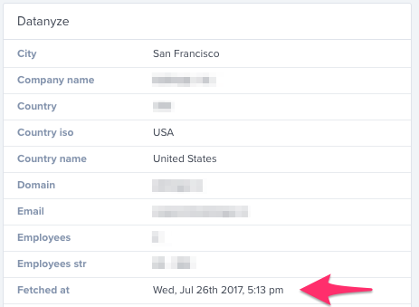
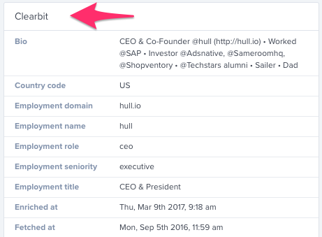

# Hull Datanyze Connector

The Datanyze Connector enables your sales and marketing teams to enrich users with accurate, real-time information on 40+ million companies from the Datanyze API.

## Getting Started

Go to the Connectors page of your Hull organization, click the button “Add Connector” and click “Install” on the Datanyze card. After installation, switch to the “Settings” tab and begin with the configuration.

Begin your configuration in the section **Authentication** by copying the Datanyze API token into the provided field. If you are not sure which key to use, see [Find your Datanyze Credentials](#Find-your-Datanyze-Credentials) for details.


Please save your changes and navigate back to the Dashboard. If you don’t see your rate limits on the Dashboard, please refresh the page. If the page displays your rate limits as shown below, you have successfully completed the basic configuration of the Connector:


Before the Connector enriches data, there are a few more steps required that are described in the section [Configure Enrichment](#Configure-Enrichment).

## Features

The Datanyze Connector allows your team to enrich user profiles with accurate, real-time information on 40+ million companies from the Datanyze API. You can leverage Hull’s powerful segmentation engine to control which users get enriched and maintain a blacklist of excluded domains. With the additional data points returned from Datanyze you can trigger further automatization in other connected tools and ensure that all your customer-facing teams have the most useful data in their system of record.

The Datanyze connector supports to `add traits` and `update traits`.

## Find your Datanyze Credentials

To find your Datanyze Credentials, log in to your account, click on your username or email address displayed in the top-right corner of the screen and choose “Settings” from the menu. Select “API” in the settings menu and you can find your current API token in the middle of the screen:


Use the token and your username or email address to complete the authentication steps described in the [Getting Started](#Getting-Started) section. If you need to change your credentials, just repeat these steps and the Connector will use the updated credentials for all future requests.

## Configure Enrichment

The Datanyze Connector automatically performs enrichment requests for user profiles stored in your Hull organization. You can control this behavior by **specifying the segments** for which data enrichment shall be performed. If you haven’t configured any segments, no calls will be made to the Datanyze API. You can define this behavior in the “Settings” tab by selecting one or more segments in the field below:


Enrichment is performed by sending a domain to the Datanyze API for which the company profile shall be fetched. Since your data in Hull is coming from multiple sources, you can define the **attribute that defines the company domain** you want to send to Datanyze.
If you have multiple attributes that can potentially contain this information, read our [Pro-Tip: How to create a fallback strategy for company domains](#Pro-Tip:-How-to-create-a-fallbback-strategy-for-company-domains).

#### When do users get enriched?

The connector attempts the enrichment as soon as the user enters one of the whitelisted segments. Please note that the segment needs to exist before the user gets created, otherwise this automatic enrichment will not be performed.
The Connector will perform up to two retries with a delay of 5 minutes between each to obtain data from Datanyze if the first attempt yields no result. These retries will not count towards your Datanyze credit usage.

Please note that users get only enriched ***exactly once***. “Once” includes the aforementioned retries, which means that after three consecutive attempts, enrichment will not be performed again even if all attempts yielded no result.

#### How long does it take to enrich users?

In most cases this process is performed near-real time. If the first attempt does not yield any result, two more retries are performed with a delay of 5 minutes each, so you will have results available within 15 minutes.

#### How can I tell if enrichment has been performed for a given user?

The Datanyze Connector adds the attribute `datanyze/fetched_at` to every user profile it has enriched. This timestamp contains either the value when data has been retrieved or marks the third attempt yielding no results, which means that Datanyze has no information about this particular company:


## Pro-Tip: How to create a fallback strategy for company domains

Data in Hull user profiles is usually composed of information from different source systems, so you might face the challenge that the domain you want to perform the lookup with is stored in different attributes. However, you can only specify a single attribute in the Datanyze Connector. To solve this problem, you can leverage the Processor and write a piece of Javascript code to perform a fallback strategy and store the result in a specific attribute that you can leverage to fetch data from Datanyze.
Here is a piece of Javascript code that you can copy and paste in your processor that is configurable to some extent and does perform a simple fallback strategy:

``` javascript
    // Name of the attribute where the unified result
    // is stored, note this will be displayed as "Domain Lookup":
    const unifiedDomainAttribute = "domain_lookup";
    // List of attributes to check for a value to determine
    // the unified domain. Note this list must be ordered, as
    // soon as a value is found for one attribute, this value will
    // be stored as unified result:
    const attributesList = [
      "clearbit.employment_domain",
      "salesforce_contact.website",
      "salesforce_lead.website",
      "domain"
      ];

    _.forEach(attributesList, (attribute) => {
      if(_.has(user, attribute) && user[attribute]) {
        traits({unifiedDomainAttribute: user[attribute]});
        return false;
      }
    });
```

The code is configurable, so you can specify the name of the attribute you want to store the result and use in the settings of your Datanyze Connector. In the example above we have chosen to name it `domain_lookup`, but you can replace it with your preferred wording.
The code performs a simple lookup by going through a list of attributes and as soon as it finds a value in an attribute, it will use this value as the unified result. To make the code work correctly, you need to put the attributes in the order from most to least preferred. The attributes are the comma-separated list between the two square brackets (lines 9 to 12). Feel free to add more lines or more remove them to match your strategy. You have probably noticed that some of the attributes contain a dot, such as `clearbit.employment_domain` while others don’t, for example `domain`. The ones with a dot are attributes that belong to a group, for example `clearbit.employment_domain` is the `employment_domain` attribute of the group `clearbit`. The ones without a dot are just simple attributes and here is how you can tell the difference:

*Simple attributes* are displayed in the group Traits of the user profile:


*Grouped attributes* are displayed within the card labelled with the group’s name. Here is an example of how `clearbit.employment_domain` looks like for a well-known member of our team:


That’s about it, once you have configured the name of unified trait and brought the attributes in the desired order, you can save your changes and either manually send users through the Processor or wait for the next change happening to a user which will automatically send it through.