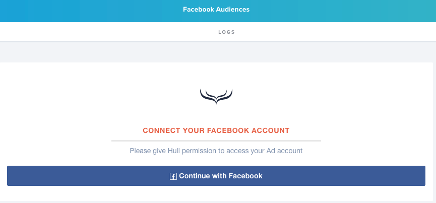
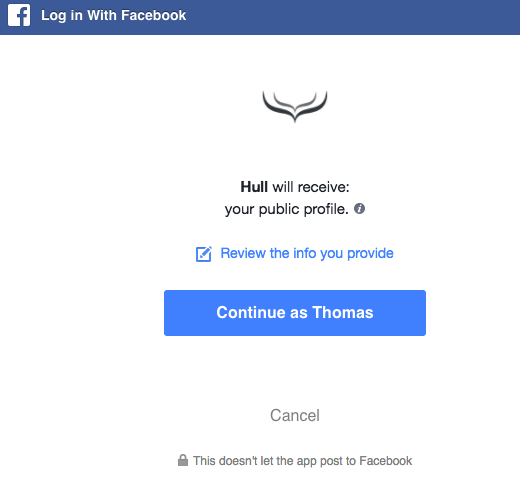
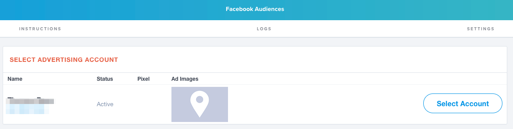
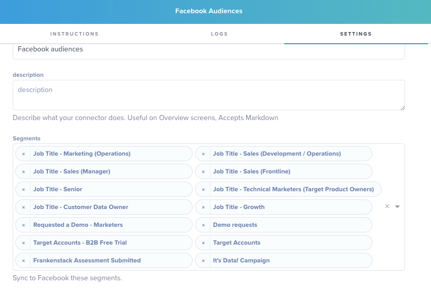
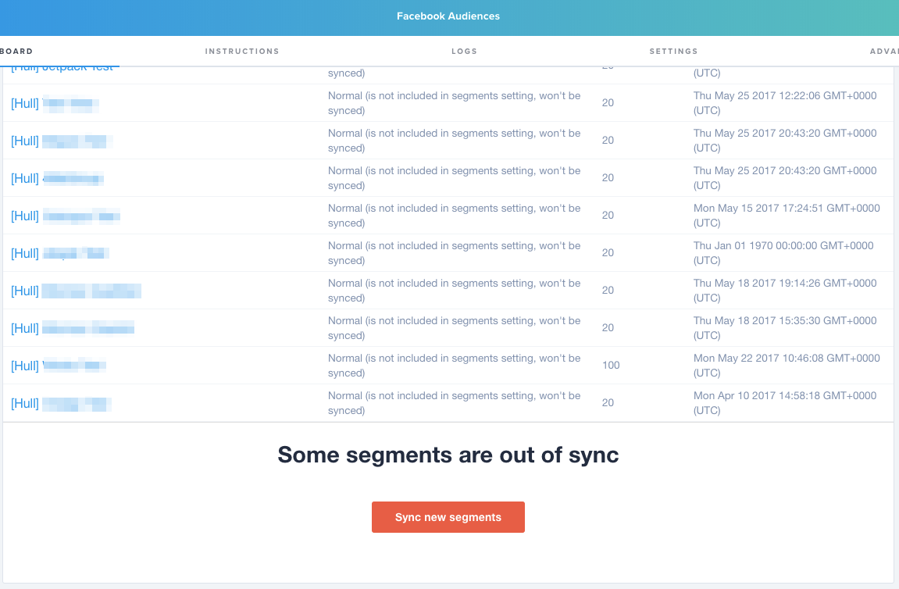
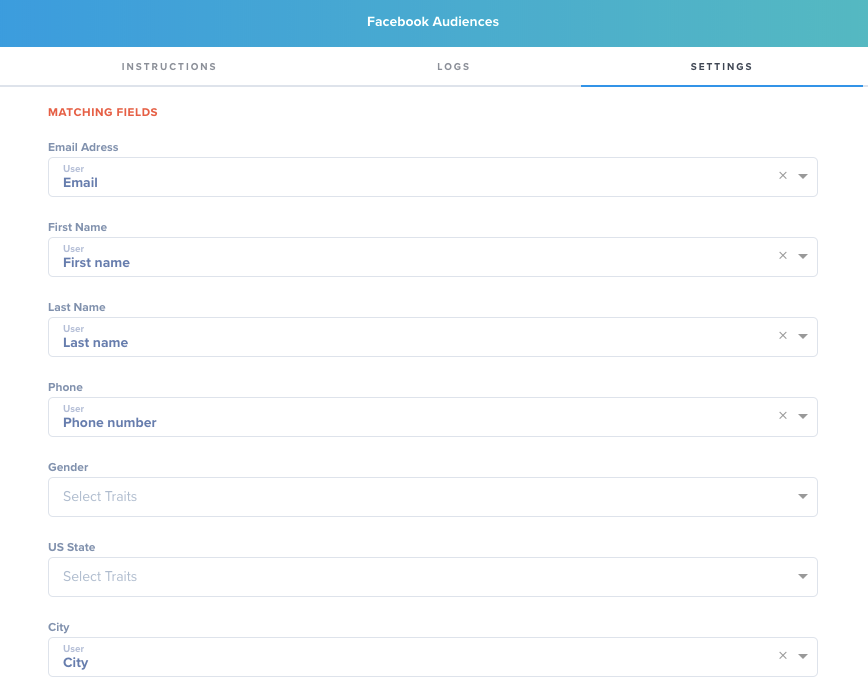
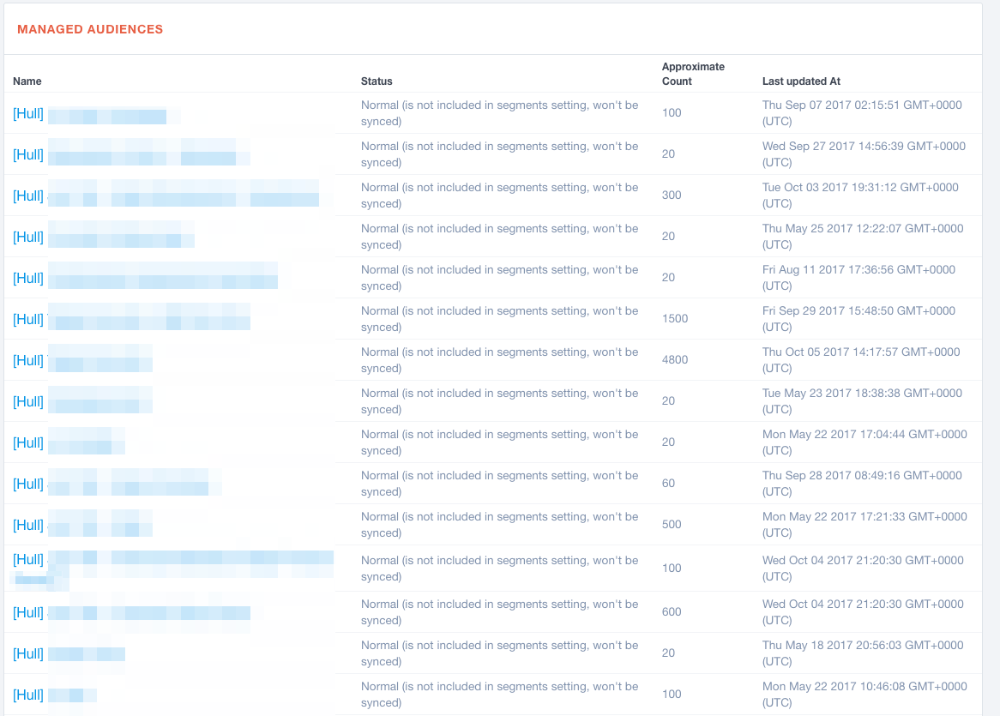

# Hull Facebook Ad Audiences Connector

The Facebook connector allows you to proactively target your ICPs whom you have emails from.

## Getting Started

Go to the Connectors page of your Hull organization, click the button “Add Connector” and click “Install” on the Facebook card. After installation, stay on the “Dashboard” tab to grant the Connector access to your Facebook Ads system.

You will get redirected to the login screen of Facebook. Authenticate the request on the Facebook website with your username and password for the Account that is using Facebook Ads:

After successful authentication you will be redirected to your Facebook connector on Hull. You are now ready to complete your setup:

Please refer to following sections to learn how to

- [Specify users to synchronize](#Specify-users-to-synchronize)
- [Determine the attributes to synchronize](#Determine-the-attributes-to-synchronize)
- [View audience sizes](#View-audience-sizes)
- [Change the ad account](#Change-the-ad-account)

## Features

The Hull Facebook Connector allows your organization to synchronize Users from Hull to Facebook Ad Audiences. Hull segments will be synchronized as audiences which you can use to build out your Facebook Ad campaigns, just like you normally would.

## Specify users to synchronize

Once you are connected to Facebook you’ll have the option to add segments of users to send to Facebook automatically. In the “Segments” section under the “Settings” heading you’ll be able to select all segments you want synced.

**Important:** After you add a new segment to this list, go to the Dashboard tab and reload the page to perform the initial synchronization. You will see a button at the bottom of the Dashboard page that indicates that there unsynchronized segments:

After the initial synchronization, Hull will automatically keep your audience updated.

## Determine the attributes to synchronize

The field mappings are very important to fill out as much as possible. Many of your user emails will be business emails, while most people sign up for Facebook with a personal email. Luckily, Facebook can match off of more than just email. The field mapping fields below allow you to choose any field from Hull and send it into Facebook. The more of these fields you have mapping the more likelihood you’l have to match up your users even without their personal email address on file.

## View audience sizes

You can view the approximate size of any audience after syncing a segment to Facebook by going to the Dashboard tab of the connector. This allows you to see how many users do have Facebook matches. All audiences created in Facebook will start with `[Hull]` in the name:

Once you have selected which segments you want whitelisted Hull will do the rest for you. As soon as 1 user within the segment is updated the connector will then fetch all users within the segment and send them into Facebook.

## How to use the logs

If you click on the tab “Logs” within your Facebook Connector you can view the operational logs. The following list explains the various log messages available:

| Message                     | Description                                                                            |
| --------------------------- | -------------------------------------------------------------------------------------- |
| `facebook.api.unauthorized` | Logged when the connection to the Facebook API failed.                                 |
| `outgoing.user.error`       | Logged when an error occurred when sending the user to Facebook.                       |
| `outgoing.user.skip`        | Logged when the user doesn’t match the criteria and is therefore not send to Facebook. |
| `outgoing.user.success`     | Logged when the user has been successfully sent to Facebook.                           |

## Change the ad account

In case you need to change your linked ad account, please uninstall your current Connector and simply install a new one from the gallery.
