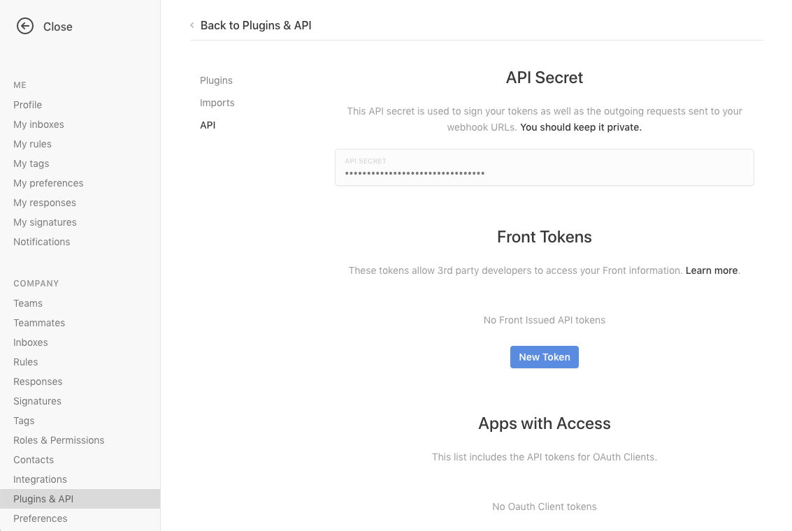
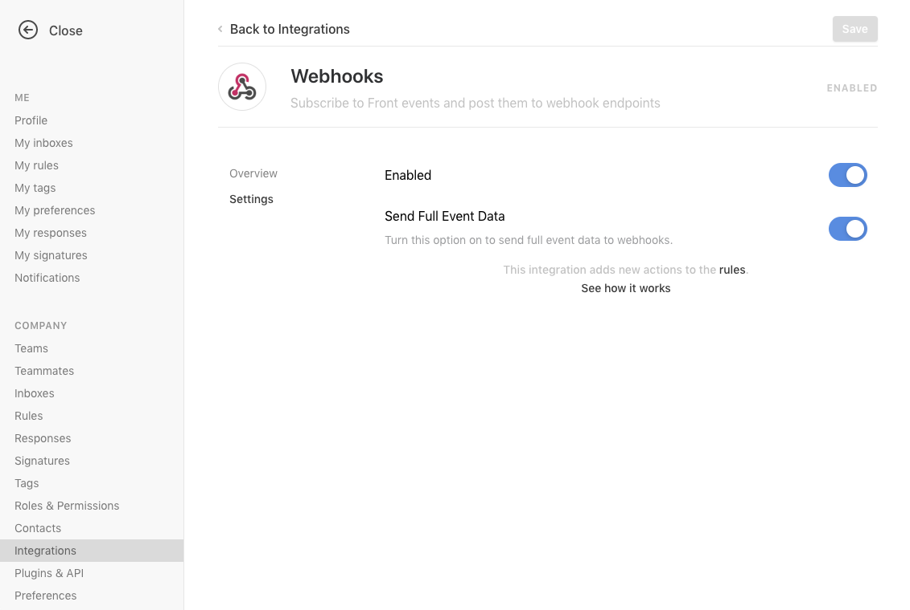
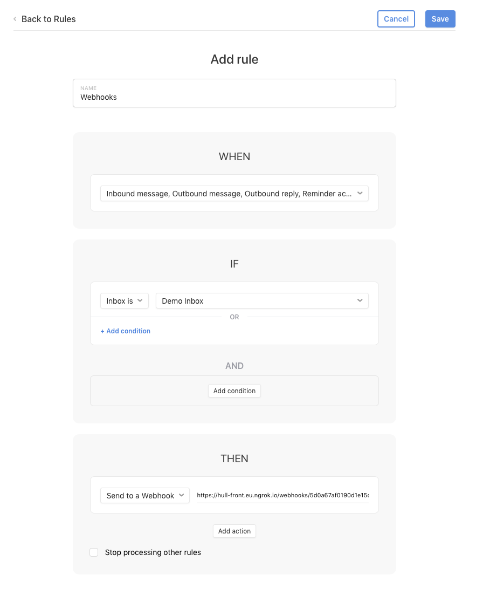

# Front

## A simple Front connector that captures the following events:

- Inbound Message
- Outbound Message
- Outbound Reply
- Reminder Activated
- Conversation Assigned
- Conversation Unassigned
- Conversation tagged
- Conversation untagged
- Message delivery failed

## For each of those events, we capture the following properties:

 Field Name | Field Value
-------|------------------------------------
event_type |
tags | Tags attached to the message
assignee_email | Email of the team member who sent or received the message
assignee_id | ID of the team member who sent or received the message
subject | Email subject
status |  "archived" / "deleted" / "spam" / "open"
id | ID of the conversation

Please refer to the [Front docs](https://dev.frontapp.com/) to see what each field means.

## Setup

### Part 1: Copy Credentials
1. Install the connector
2. Go to [Settings > Plugins & API](https://app.frontapp.com/settings/tools/api) and copy the API Secret. Paste it in the Connector Settings in Hull

### Part 2: Enable Webhooks
1. Go to [https://app.frontapp.com/settings/integrations/native](https://app.frontapp.com/settings/integrations/native) and enable Webhooks integration
2. Go to Settings, click `Enabled`, and `Send Full Event Data`

### Part 3: Define Rules
1. Go to `My Rules` (and optionally, you'll want to do this for `Company Rules` too) in the sidebar
2. Click `Add an individual Rule` (or `Add a team Rule`)
3. Select the following: `Inbound Message` `Outbound Message` `Outbound Reply` `Reminder Activated` `Conversation Assigned` `Conversation Unassigned` `Conversation tagged` `Conversation untagged` `Message delivery failed`
4. Copy the URL from the Connector's Settings tab, select `Send to a webhook`, and paste the Hull URL you copied in the `Then` section

See Front's [docs here](https://help.frontapp.com/t/x129yt/how-to-enable-and-use-the-webhooks-integration) if you need more help, or contact us!
