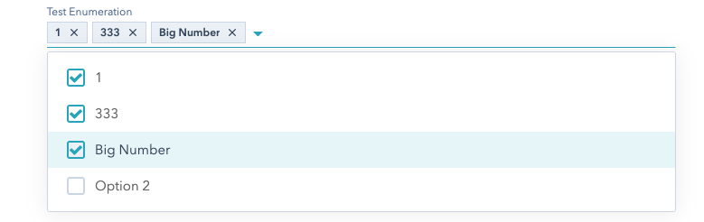

Hull’s [HubSpot integration](https://hull.io/integrations/hubspot/) enables syncing of HubSpot Contacts & Companies with all your other tools through Hull’s [Customer Data Platform](https://hull.io/features/). Teams use Hull with HubSpot for:

- [Lead qualification](https://www.hull.io/playbooks/lead-qualification/)
- [Lead nurturing](https://www.hull.io/playbooks/lead-nurturing/)
- [Sales enablement](https://www.hull.io/playbooks/sales-enablement/)
- [CRM integration](https://www.hull.io/integrations/crm/)
- [Email integration](https://www.hull.io/integrations/email/)

If you have questions, feedback, or spot any outdated information, we’d love to hear from you via [email](mailto:support@hull.io) or [chat](#arrangeDemo).

## Getting Started

To install the HubSpot integration, you must have a HubSpot admin permissions to add and authenticate third party apps.

1. Login to your Hull Organization and navigate to **Connectors** menu in the top navigation
2. Choose **Add a Connector**
3. Click on **HubSpot**
4. Confirm by clicking **Install**
5. Within the Connector, click on **Credentials & Actions**. You will need to login with your HubSpot credentials to connect your HubSpot instance.


### Configure your HubSpot Connector Settings

In the HubSpot Connector Dashboard, click the **Settings** tab. Here you can set the rules to map, filter & link incoming & outgoing data.

There are four sections of settings:

- Outgoing Users
  - Whitelist Users to sync with User Segments
  - Map User Attributes to HubSpot Contacts
- Incoming Users
  - Map HubSpot Contact identifiers
  - Map HubSpot Contact properties to Hull Users
- Outgoing Accounts
  - Whitelist Accounts to sync with Account Segments
  - Map Account Attributes to HubSpot Company Properties
  - Toggle if Hull will link HubSpot Contacts & Companies
- Incoming Accounts
  - Toggle HubSpot Companies to sync into Hull
  - Map HubSpot Company identifiers
  - Map HubSpot Company Properties to Hull Accounts
  - Toggle if Hull will link Users & Accounts based on HubSpot Contact-Company associations.

## Identity Resolution

Hull can sync the following objects to HubSpot. New data is upserted in both directions - existing profiles are updated, else new profiles are created automatically.

| Data Object | Hull    | HubSpot |
| ----------- | ------- | ------- |
| Person      | [User](https://www.hull.io/docs/concepts/users/)    | Contact |
| Company     | [Account](https://www.hull.io/docs/concepts/accounts/) | Company |

> **Note:** HubSpot Companies are not handled by default. You must configure this.


### Fetching HubSpot Contacts into Hull

HubSpot Contacts and their updates are fetched into Hull manually or on a schedule.

When new data about a HubSpot Contact is [ingested](https://www.hull.io/docs/data_lifecycle/ingest/), Hull follows this process:

1. Checks if there is a matching `email`
2. If so, updates the existing Hull User
3. Else, creates a new Hull User

HubSpot Contact `VID` is captured as an `anonymous_id` and `hubspot/id` in Hull User profiles.

> **Note:** If more than one Hull User exists with the same `email` or HubSpot Contact `VID` and without a unique external_id then they will be merged. A `User merged` event will show the before/after difference in attribute values. Learn more about [User merging](https://www.hull.io/docs/data_lifecycle/ingest/#user-merging)

### Fetching HubSpot Companies into Hull

HubSpot Companies are not handled by default. This must be enabled in the Connector Settings under the **Fetch accounts** toggle.

You must select what account-level identifier to map into. This is `domain` by default.

HubSpot Companies and their updates are fetched automatically on a schedule. This can be also be fetched manually in the **Credentials & Actions** tab.

When new data about a HubSpot Company is ingested, Hull follows this process:

1. Check if the required identifier is present (e.g. `domain` for default). Skip if not.
2. Checks if there is a matching identifier in Hull (e.g. `domain`)
3. If so, updates the existing Hull Account
4. Else, creates a new Hull Account

HubSpot Company `ID` is captured as an `anonymous_id` in Hull Account profiles.

> **Note:** If more than one Hull Account exists with the same `domain` and without a unique external_id then they will be merged. Learn more about [Account merging](https://www.hull.io/docs/data_lifecycle/ingest/#account-merging).

### Linking HubSpot Contacts & Companies in Hull

Hull will associate Users and Accounts by a common `domain`. e.g. `romain@hull.io` and `www.hull.io` will be associated.

If you’d also like to match Users and Accounts in Hull by the Contact-Company relationships you have in HubSpot, you can configure this in the Connector Settings under the **Link users in Hull** toggle.

Hull will link Users with Accounts if:

- Link users in Hull is enabled
- HubSpot Contact is associated with a HubSpot Company
- HubSpot Contact has a valid identifier

If the HubSpot Company does not have a required identifier, the User will be associated with an empty Hull Account.

### Creating & Updating HubSpot Contacts

Hull Users must be in a whitelisted [User Segment](https://www.hull.io/docs/concepts/segments/) to be synced to HubSpot. By default, no Users are synced.

When Hull publishes a [User Update](https://www.hull.io/docs/data_lifecycle/notify/#format-of-a-user-update-notification) for a User whitelisted to sync to HubSpot:

1. Check if there is an `email`. Skip if not.
2. If `email` exists, sync User Update to HubSpot.
3. HubSpot will then check if an existing Contact exists with the same `email` or `hubspot/id` (Contact `VID` in HubSpot)
4. If so, HubSpot will update the existing Contact
5. Else, HubSpot will create a new Contact

### Creating & Updating HubSpot Companies

Hull Accounts must be in a whitelisted [Account Segment](https://www.hull.io/docs/concepts/segments/) to be synced to HubSpot. By default, no Accounts are synced.

When Hull publishes an [Account Update](https://www.hull.io/docs/data_lifecycle/notify/#format-of-an-account-update-notification) for an Account whitelisted to sync to HubSpot

1. Check if there is an `domain`. Skip if not.
2. If `domain` exists, sync Account Update to HubSpot
2. HubSpot will then check if an existing Company exists with the same `domain`
3. If so, HubSpot will update the existing Company
4. Else, HubSpot will create a new Company

### Linking Hull Users & Accounts in HubSpot

You can associate HubSpot Contacts and Companies based on logic you have in Hull. Click the **Link Contacts in Hubspot** toggle in the Connector Settings.

Hull will link Contacts & Companies in HubSpot if:

- Link Contacts in HubSpot is enabled
- Hull User is associated with a Hull Account
- Hull Account is already synchronized with a HubSpot Company

## Data Mapping

Filter which Users & Accounts are synced to HubSpot with [User & Account Segments](https://www.hull.io/docs/concepts/segments/) in the Connector Settings.

Map which User & Account attributes are synced to and from HubSpot with the field mappers in the Connector Settings.

### Hull Data types

Quoted from Hull's [documentation](https://www.hull.io/docs/data_lifecycle/ingest/):
```text
Supported Attribute values include:

- Strings
- Array of strings
- Numeric
- Booleans
- Dates (ISO-8601 formatted strings or UNIX timestamps)
- Nested JSON Object (experimental support, use carefully)
```

### Hubspot Data types

- Strings
- Numbers
- Booleans
- Date [📚](https://developers.hubspot.com/docs/faq/how-should-timestamps-be-formatted-for-hubspots-apis)
  ```text
    Date properties will only store the date, and must be set to midnight UTC for the date you want.
    For example, May 1 2015 would be 1430438400000 (01 May 2015 00:00:00 UTC).
  ```
  Hull stores dates using hours, minutes, and seconds. The connector will convert a date to the appropriate format that
  Hubspot expects by removing the hours, minutes, seconds of the related date. You will loose some precision,
  **otherwise Hubspot won't accept** that date.

 - Datetime [📚](https://developers.hubspot.com/docs/faq/how-should-timestamps-be-formatted-for-hubspots-apis)
  ```text
    Datetime properties can store any time, so any valid millisecond timestamp would be accepted.
    In HubSpot, datetime properties are displayed based on the time zone of the user viewing the record,
    so the value will be converted to the local time zone of the user.
  ``` 
  Here the Hubspot's `Datetime` format is exactly the same as Hull's `Date` format.

- Enumeration (made of above types), mostly used as a *"choose your value(s)"* from a dropdown list.
  In this data type, you can end up having an array of the selected type.
  Such a thing is happening for the `Hull-segments` field that you can notice in any Hubspot contact imported from Hull.
  
*📚 Other links used for that documentation*
  - [*Contact Properties Overview*](https://developers.hubspot.com/docs/methods/contacts/contact-properties-overview)
  - [*Company Properties Overview*](https://developers.hubspot.com/docs/methods/companies/company-properties-overview)

### Data mapping

Here you will find what type conversions are supported in the table below.
- ✅ : Works and is intuitive to convert 
- ⚠️ : Can work but under certain condition(s)
- ❌ : Cannot be converted or would not make sense to

#### Outgoing - From Hull to Hubspot data types
| Hull Type               | Hubspot String |  Hubspot Number  |         Hubspot Bool        |          Hubspot Date         | Hubspot Datetime | Hubspot Enumeration |
|-------------------------|:--------------:|:----------------:|:---------------------------:|:-----------------------------:|:----------------:|:-------------------:|
| String                  |        ✅       |        ✅       |            ⚠️¹             |               ❌               |        ❌       |          ❌         |
| String_Array            |        ❌       |        ❌       |             ❌             |               ❌               |        ❌       |          ✅         |
| Numeric                 |        ✅       |        ✅       |            ⚠️²             |               ❌               |        ❌       |          ❌         |
| Boolean                 |        ✅       |        ✅       |             ✅             |               ❌               |        ❌       |          ❌         |
| Date                    |        ✅       |        ✅       |             ❌             |              ⚠️³               |        ✅       |          ❌         |
| JSON                    |        ❌       |        ❌       |             ❌             |               ❌               |        ❌       |          ❌         |

  1. Hull String must be "True" or "False"
  2. Hull Number must be 0 or 1
  3. Hours:Minutes:Seconds will be removed

#### Incoming - From Hubspot to Hull data types

| Hubspot type | Hull String | Hull Array of strings | Hull Bool | Hull Date | Hull JSON |
|--------------|:-----------:|:---------------------:|:---------:|:---------:|:---------:|
| String       |      ✅     |           ❌          |    ⚠️¹   |     ✅    |     ❌    |
| Number       |      ✅     |           ❌          |    ⚠️²   |     ❌    |     ❌    |
| Bool         |      ✅     |           ❌          |    ✅    |     ❌    |     ❌    |
| Date         |      ✅     |           ❌          |    ❌    |     ✅    |     ❌    |
| Datetime     |      ✅     |           ❌          |    ❌    |    ️✅    |     ❌    |
| Enumeration  |      ❌     |           ✅          |    ❌    |     ❌    |     ❌    |

1. Hubspot String must be "True" or "False"
2. Hubspot Number must be 0 or 1

### Special cases

#### Hubspot - Picklist
##### How to use them
A Hubspot "Picklist" is a Hubspot field with a customizable format. Most of the time, you will encounter them under
the format of a dropdown field with a list of checkboxes. To reach that result, picklists have in their definitions
the `Enumeration` Hubspot `"type"`, and the `Checkbox` Hubspot `"fieldType"` .
More information can be found in Hubspot's API [📚](https://developers.hubspot.com/docs/methods/contacts/v2/create_contacts_property)

Here is what would be the definition of an `Enumeration` using that dropdown of checkboxes:
```json
{
    	"name": "hull_test_enum",
    	"label": "Test Enumeration",
    	"groupName": "hull",
    	"type": "enumeration",
    	"fieldType": "checkbox",
    	"options": [
        {
          "label": 1,
          "value": 1
        },
        {
          "label": "Option 2",
          "value": 2
        },
        {
          "label": 333,
          "value": "3"
        },
        {
          "label": "Big Number",
          "value": 1565354818310
        }
      ]
    }
```

This enum results in the following Hubspot UI element:


All the selected options in that field will be stored in the contact properties using the following format:
```json
{
 "value": "1;3;1565354818310"
}
```
Note here that the selected options are referred with the `"value"` fields defined above, not as their `"labels"`.

##### Conversion
The Hull - string array <=> Hubspot - Enum conversion works in both directions, by parsing each values separated
by a `;` for incoming data.

In the case of outgoing data, for each element in the Hull - string array, `"value"` and `"label"` fields  will share
the same value when creating the definition of the Hubspot enumeration. You will not be able to customise the label if
you export a Hull - string array to Hubspot.

### Data types supported

| Data type                   | Hull               | HubSpot                                          |
| --------------------------- | ------------------ | ------------------------------------------------ |
| Standard Person Attributes  | User Attributes    | Contact Properties                               |
| Custom Person Attributes    | User Attributes    | Custom Contact Properties (grouped under `Hull`) |
| Standard Company Attributes | Account Attributes | Company Properties                               |
| Custom Company Attributes   | Account Attributes | Custom Company Properties (grouped under `Hull`) |

### Fetching HubSpot Properties

All default HubSpot Contact & Company Properties are fetched and stored as a HubSpot attributes group on Hull User & Account profiles.

In the Connector Settings, under the **Custom Fields Sync (HubSpot to Hull)** headings for Users & Accounts, you can map and name HubSpot Custom Properties into Hull. These will also appear under the HubSpot attributes group on Hull User & Account profiles.

### Creating & Updating HubSpot Properties

In the connector settings, under the **Custom Fields Sync (Hull to Hubspot)** headings for Users & Accounts, you can map Hull User & Account Attributes to Custom Properties in HubSpot Contact & Company profiles. These will appear under a Hull group in HubSpot.

You can create new properties in HubSpot from Hull field mapping. As you type right column of the field mapper, you’ll be prompted to “Create” the field you’re typing.

### Segmentation

You can sync Hull [User & Account Segments](https://www.hull.io/docs/concepts/segments/) to HubSpot.

| Group               | Hull             | HubSpot                          |
| ------------------- | ---------------- | -------------------------------- |
| Groups of people    | User Segments    | `Hull_Segments` contact property |
| Groups of companies | Account Segments | `Hull_Segments` company property |

### Default Contact Mappings

| Name                                          | Hull                                       | Type    | Title                                   | Read Only |
| :---                                          | :---:                                      | :---:   | :---:                                   | ---:      |
| email                                         | email                                      | string  | Email                                   | false     |  
| salutation                                    | hubspot/salutation                         | string  | Salutation                              | false     |  
| firstname                                     | hubspot/first_name                         | string  | First Name                              | false     |  
| lastname                                      | hubspot/last_name                          | string  | Last Name                               | false     |  
| phone                                         | hubspot/phone                              | string  | Phone number                            | false     |  
| mobilephone                                   | hubspot/mobile_phone                       | string  | Mobile Phone number                     | false     |  
| address                                       | hubspot/address_street                     | string  | Street Address                          | false     |  
| city                                          | hubspot/address_city                       | string  | City                                    | false     |  
| zip                                           | hubspot/address_postal_code                | string  | Postal Code                             | false     |  
| state                                         | hubspot/address_state                      | string  | State/Region                            | false     |  
| country                                       | hubspot/address_country                    | string  | Country                                 | false     |  
| fax                                           | hubspot/fax                                | string  | Fax number                              | false     |  
| company                                       | hubspot/company                            | string  | Company Name                            | false     |  
| industry                                      | hubspot/industry                           | string  | Industry                                | false     |  
| jobtitle                                      | hubspot/job_title                          | string  | Job Title                               | false     |  
| numemployees                                  | hubspot/employees_count                    | number  | Number of Employees                     | false     |  
| website                                       | hubspot/website                            | string  | Website URL                             | false     |  
| createdate                                    | hubspot/created_at                         | date    | Create Date                             | false     |  
| closedate                                     | hubspot/closed_at                          | date    | Close Date                              | false     |  
| lastmodifieddate                              | hubspot/updated_at                         | date    | Last Modified Date                      | false     |  
| annualrevenue                                 | hubspot/annual_revenue                     | number  | Annual Revenue                          | false     |  
| total_revenue                                 | hubspot/total_revenue                      | number  | Total Revenue                           | false     |  
| lifecyclestage                                | hubspot/lifecycle_stage                    | string  | Lifecycle Stage                         | false     |  
| days_to_close                                 | hubspot/days_to_close                      | number  | Days To Close                           | true      |  
| first_deal_created_date                       | hubspot/first_deal_created_at              | date    | First Deal Created Date                 | false     |  
| num_associated_deals                          | hubspot/associated_deals_count             | number  | Associated Deals                        | true      |  
| hubspot_owner_id                              | hubspot/hubspot_owner_id                   | string  | HubSpot Owner                           | false     |  
| hs_email_optout                               | hubspot/email_optout                       | boolean | Opted out of all email                  | true      |  
| blog_default_hubspot_blog_subscription        | hubspot/default_hubspot_blog_subscription  | boolean | Default HubSpot Blog Email Subscription | false     |  
| message                                       | hubspot/message                            | string  | Message                                 | false     |  
| recent_deal_amount                            | hubspot/recent_deal_amount                 | number  | Recent Deal Amount                      | false     |  
| recent_deal_close_date                        | hubspot/recent_deal_closed_at              | date    | Recent Deal Close Date                  | false     |  
| num_notes                                     | hubspot/notes_count                        | number  | Number of Sales Activities              | true      |  
| num_contacted_notes                           | hubspot/contacted_notes_count              | string  | Number of times contacted               | true      |  
| notes_last_contacted                          | hubspot/notes_last_contacted_at            | date    | Last Contacted                          | false     |  
| notes_last_updated                            | hubspot/last_activity_at                   | date    | Last Activity Date                      | false     |  
| notes_next_activity_date                      | hubspot/next_activity_at                   | date    | Next Activity Date                      | false     |  
| hubspot_owner_assigneddate                    | hubspot/owner_assigned_at                  | date    | Owner Assigned Date                     | false     |  
| hs_lead_status                                | hubspot/lead_status                        | string  | Lead Status                             | false     |  
| hs_lifecyclestage_customer_date               | hubspot/became_customer_at                 | date    | Became a Customer Date                  | false     |  
| hs_lifecyclestage_lead_date                   | hubspot/became_lead_at                     | date    | Became a Lead Date                      | false     |  
| hs_lifecyclestage_marketingqualifiedlead_date | hubspot/became_marketing_qualified_lead_at | date    | Became a Marketing Qualified Lead Date  | false     |  
| hs_lifecyclestage_salesqualifiedlead_date     | hubspot/became_sales_qualified_lead_at     | date    | Became a Sales Qualified Lead Date      | false     |  
| hs_lifecyclestage_subscriber_date             | hubspot/became_subscriber_at               | date    | Became a Subscriber Date                | false     |  
| hs_lifecyclestage_evangelist_date             | hubspot/became_evangelist_at               | date    | Became an Evangelist Date               | false     |  
| hs_lifecyclestage_opportunity_date            | hubspot/became_opportunity_at              | date    | Became an Opportunity Date              | false     |  
| hs_lifecyclestage_other_date                  | hubspot/became_other_at                    | date    | Beame an Other Lifecycle Date           | false     |  
| hs_email_bounce                               | hubspot/emails_bounced_count               | number  |                                         | true      |  
| hs_email_open                                 | hubspot/opened_count                       | number  |                                         | true      |  
| associatedcompanyid                           | hubspot/associatedcompanyid                | string  |                                         | false     |  


### Default Company Mappings


| Hubspot                                      |  Hull                                                 | Type        | Title                           | Read Only |
| :---                                         | :---:                                                 | :---:       | :---:                           | ---:      |
| about_us                                     | hubspot/about_us                                      | string      | About Us                        | false     |
| first_deal_created_date                      | hubspot/first_deal_created_date                       | datetime    | First Deal Created Date         | true      |
| founded_year                                 | hubspot/founded_year                                  | string      | Year Founded                    | false     |
| hs_avatar_filemanager_key                    | hubspot/hs_avatar_filemanager_key                     | string      | Avatar FileManager key          | true      |
| hs_lastmodifieddate                          | hubspot/hs_lastmodified_date                          | datetime    | Last Modified Date              | true      |
| hs_predictivecontactscore_v2                 | hubspot/hs_predictivecontactscore_v2                  | number      | Likelihood to close             | true      |
| hubspot_owner_assigneddate                   | hubspot/hubspot_owner_assigned_date                   | datetime    | Owner Assigned Date             | true      |
| is_public                                    | hubspot/is_public                                     | bool        | Is Public                       | false     |
| num_associated_contacts                      | hubspot/num_associated_contacts                       | number      | Associated Contacts             | true      |
| num_associated_deals                         | hubspot/num_associated_deals                          | number      | Associated Deals                | true      |
| recent_deal_amount                           | hubspot/recent_deal_amount                            | number      | Recent Deal Amount              | true      |
| recent_deal_close_date                       | hubspot/recent_deal_close_date                        | datetime    | Recent Deal Close Date          | true      |
| timezone                                     | hubspot/timezone                                      | string      | Time Zone                       | false     |
| total_money_raised                           | hubspot/total_money_raised                            | string      | Total Money Raised              | false     |
| total_revenue                                | hubspot/total_revenue                                 | number      | Total Revenue                   | true      |
| name                                         | hubspot/name                                          | string      | Name                            | false     |
| phone                                        | hubspot/phone                                         | string      | Phone Number                    | false     |
| address                                      | hubspot/address                                       | string      | Street Address                  | false     |
| address2                                     | hubspot/address2                                      | string      | Street Address 2                | false     |
| city                                         | hubspot/city                                          | string      | City                            | false     |
| state                                        | hubspot/state                                         | string      | State/Region                    | false     |
| hs_sales_email_last_replied                  | hubspot/hs_sales_email_last_replied                   | datetime    | Recent Sales Email Replied Date | true      |
| hubspot_owner_id                             | hubspot/hubspot_owner_id                              | enumeration | Company owner                   | false     |
| notes_last_contacted                         | hubspot/notes_last_contacted_at                       | datetime    | Last Contacted                  | true      |
| notes_last_updated                           | hubspot/notes_last_updated_at                         | datetime    | Last Activity Date              | true      |
| notes_next_activity_date                     | hubspot/notes_next_activity_date                      | datetime    | Next Activity Date              | true      |
| num_contacted_notes                          | hubspot/num_contacted_notes                           | number      | Number of times contacted       | true      |
| num_notes                                    | hubspot/num_notes                                     | number      | Number of Sales Activities      | true      |
| zip                                          | hubspot/zip                                           | string      | Postal Code                     | false     |
| country                                      | hubspot/country                                       | string      | Country                         | false     |
| hubspot_team_id                              | hubspot/hubspot_team_id                               | enumeration | HubSpot Team                    | true      |
| hs_all_owner_ids                             | hubspot/hs_all_owner_ids                              | enumeration | All owner ids                   | true      |
| website                                      | hubspot/website                                       | string      | Website URL                     | false     |
| domain                                       | hubspot/domain                                        | string      | Company Domain Name             | false     |
| hs_all_team_ids                              | hubspot/hs_all_team_ids                               | enumeration | All team ids                    | true      |
| hs_all_accessible_team_ids                   | hubspot/hs_all_accessible_team_ids                    | enumeration | All accessible team ids         | true      |
| numberofemployees                            | hubspot/numberofemployees                             | number      | Number of Employees             | false     |
| industry                                     | hubspot/industry                                      | enumeration | Industry                        | false     |
| annualrevenue                                | hubspot/annualrevenue                                 | number      | Annual Revenue                  | false     |
| lifecyclestage                               | hubspot/lifecyclestage                                | enumeration | Lifecycle Stage                 | false     |
| hs_lead_status                               | hubspot/hs_lead_status                                | enumeration | Lead Status                     | false     |
| hs_parent_company_id                         | hubspot/hs_parent_company_id                          | number      | Parent Company                  | true      |
| type                                         | hubspot/type                                          | enumeration | Type                            | false     |
| description                                  | hubspot/description                                   | string      | Description                     | false     |
| hs_num_child_companies                       | hubspot/hs_num_child_companies                        | number      | Number of child companies       | true      |
| createdate                                   | hubspot/create_date                                   | datetime    | Create Date                     | true      |
| closedate                                    | hubspot/close_date                                    | datetime    | Close Date                      | false     |
| first_contact_createdate                     | hubspot/first_contact_create_date                     | datetime    | First Contact Create Date       | true      |
| web_technologies                             | hubspot/web_technologies                              | enumeration | Web Technologies                | false     |
| facebookfans                                 | hubspot/facebookfans                                  | number      | Facebook Fans                   | false     |
| twitterhandle                                | hubspot/twitterhandle                                 | string      | Twitter Handle                  | false     |
| twitterbio                                   | hubspot/twitterbio                                    | string      | Twitter Bio                     | false     |
| twitterfollowers                             | hubspot/twitterfollowers                              | number      | Twitter Followers               | false     |
| facebook_company_page                        | hubspot/facebook_company_page                         | string      | Facebook Company Page           | false     |
| linkedin_company_page                        | hubspot/linkedin_company_page                         | string      | LinkedIn Company Page           | false     |
| linkedinbio                                  | hubspot/linkedinbio                                   | string      | LinkedIn Bio                    | false     |
| googleplus_page                              | hubspot/googleplus_page                               | string      | Google Plus Page                | false     |
| hs_analytics_first_timestamp                 | hubspot/hs_analytics_first_timestamp                  | datetime    | Time First Seen                 | true      |
| hs_analytics_first_touch_converting_campaign | hubspot/hs_analytics_first_touch_converting_campaign  | string      | First Touch Converting Campaign | true      |
| hs_analytics_first_visit_timestamp           | hubspot/hs_analytics_first_visit_timestamp            | datetime    | Time of First Visit             | true      |
| hs_analytics_last_timestamp                  | hubspot/hs_analytics_last_timestamp                   | datetime    | Time Last Seen                  | true      |
| hs_analytics_last_touch_converting_campaign  | hubspot/hs_analytics_last_touch_converting_campaign   | string      | Last Touch Converting Campaign  | true      |
| hs_analytics_last_visit_timestamp            | hubspot/hs_analytics_last_visit_timestamp             | datetime    | Time of Last Session            | true      |
| hs_analytics_num_page_views                  | hubspot/hs_analytics_num_page_views                   | number      | Number of Pageviews             | true      |
| hs_analytics_num_visits                      | hubspot/hs_analytics_num_visits                       | number      | Number of Visits                | true      |
| hs_analytics_source                          | hubspot/hs_analytics_source                           | enumeration | Original Source Type            | true      |
| hs_analytics_source_data_1                   | hubspot/hs_analytics_source_data_1                    | string      | Original Source Data 1          | true      |
| hs_analytics_source_data_2                   | hubspot/hs_analytics_source_data_2                    | string      | Original Source Data 2          | true      |
| days_to_close                                | hubspot/days_to_close                                 | number      | Days to Close                   | true      |
  

## Sync Frequency & Limitations

Hull ingests data from the HubSpot connector through the [Firehose API](https://www.hull.io/docs/data_lifecycle/ingest/#messages).

Learn more about [HubSpot’s API usage guidelines](https://developers.hubspot.com/apps/api_guidelines).

| HubSpot API limits             | 40,000 per day                    |
| ------------------------------ | --------------------------------- |
| HubSpot Rate Limits            | 10 requests per second            |
| Bulk operation limitations     | Batches of 100 contacts/customers |
| Fetch updates sync frequency   | Every 5 minutes                   |
| Sync data from Hull to HubSpot | With every User or Account update |

## Troubleshooting

### I don’t get any HubSpot Company data in Hull

Check you have setup identifiers for accounts. See [data mapping](#data-mapping)

### I don’t get updates of recently updated Contacts or Companies into Hull

Check your connector logs for any `incoming.job.error`. If you see any with `Permission error`, you need to re-authenticate the HubSpot Connector. Go to the **Credentials & Actions** and perform the OAuth flow authorization again using the **Start over** button.

All your connector settings (including data mapping) will remain the same.

After re-authenticating, your data flow should resume. You can also run a **Fetch all Contacts** or **Fetch all Companies** in the connectors tab. Search the connector logs for `incoming.user.success` or `incoming.account.success` to verify data is flowing again - this can take up to 5 minutes.

**Note:** Make sure you link with the same HubSpot portal. Changing the portal can lead to data corruption.

### I don’t see recently mapped fields in Hull

In the HubSpot Connector settings, go to **Credentials & Actions** and then click **Fetch all Contacts** for contact properties or **Fetch all Companies** for company properties.

It may take a few minutes for the import of data to be ingested and be shown in Hull.

### I don’t see recently mapped fields in HubSpot

You can manually sync the Users and Accounts to HubSpot. Go to the User or Account Profiles, or create a User or Account Segment then select the **Send to** button and choose HubSpot. Click confirm.

### I get empty companies in Hull

Make sure you set the required account identifiers in the Connector settings.

### My Hubspot Contact or Companies are not updated due to "duplicate property value" error

If you see `duplicate property value` error in your `outgoing.user.error` or `outgoing.account.error` logs it means that you have duplicate entry in your outgoing attribute mapping.

You can inspect `hubspotWriteContact` parameter in the logs to see the exact payload the connector tried & failed to send to Hubspot. Search for any attribute name which appears twice in the same payload. Once you have identified the duplicate attribute, remove the extra entry in the attributes mapper in the Connector Settings.

Once you have reconfigured you data mapping, resend the affected Users & Accounts to HubSpot with the **Send to** button on the Profiles or Segmentation tool.

### Any questions?

If you have any questions or have suggestions to improve this documentation, please [email](mailto:support@hull.io) or [chat to us](#arrangeDemo).
