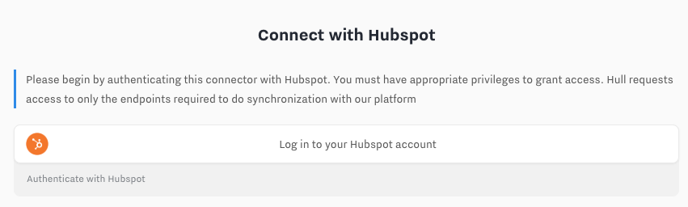

Hull’s [HubSpot integration](https://hull.io/integrations/hubspot/) enables syncing of HubSpot Contacts & Companies with all your other tools through Hull’s [Customer Data Platform](https://hull.io/features/). Teams use Hull with HubSpot for:

- [Lead qualification](https://www.hull.io/playbooks/lead-qualification/)
- [Lead nurturing](https://www.hull.io/playbooks/lead-nurturing/)
- [Sales enablement](https://www.hull.io/playbooks/sales-enablement/)
- [CRM integration](https://www.hull.io/integrations/crm/)
- [Email integration](https://www.hull.io/integrations/email/)

If you have questions, feedback, or spot any outdated information, we’d love to hear from you via [email](mailto:support@hull.io) or [chat](#arrangeDemo).

## Getting Started

To install the HubSpot integration, you must have a HubSpot admin permissions to add and authenticate third party apps.

1. Login to your Hull Organization and navigate to **Connectors** menu in the top navigation
2. Choose **Add a Connector**
3. Click on **HubSpot**
4. Confirm by clicking **Install**
5. Within the Connector, click on **Credentials & Actions**. You will need to login with your HubSpot credentials to connect your HubSpot instance.

### Configure your HubSpot Connector Settings

In the HubSpot Connector Dashboard, click the **Settings** tab. Here you can set the rules to map, filter & link incoming & outgoing data.

There are four sections of settings:

**1. Outgoing Users**
  1. Whitelist Users to sync with User Segments
  2. Map User Attributes to HubSpot Contacts
**2. Incoming Users**
  1. Map HubSpot Contact identifiers
  2. Map HubSpot Contact properties to Hull Users
**3. Outgoing Accounts**
  1. Whitelist Accounts to sync with Account Segments
  2. Map Account Attributes to HubSpot Company Properties
  3. Toggle if Hull will link HubSpot Contacts & Companies
**4. Incoming Accounts**
  1. Toggle HubSpot Companies to sync into Hull
  2. Map HubSpot Company identifiers
  3. Map HubSpot Company Properties to Hull Accounts
  4. Toggle if Hull will link Users & Accounts based on HubSpot Contact-Company associations.

## Identity Resolution

Hull can sync the following objects to HubSpot. New data is upserted in both directions - existing profiles are updated, else new profiles are created automatically.

| Data Object | Hull    | HubSpot |
| ----------- | ------- | ------- |
| Person      | [User](https://www.hull.io/docs/concepts/users/)    | Contact |
| Company     | [Account](https://www.hull.io/docs/concepts/accounts/) | Company |

> **Note:** HubSpot Companies are not handled by default. You must configure this.

### Fetching HubSpot Contacts into Hull

HubSpot Contacts and their updates are fetched into Hull manually or on a schedule.

When new data about a HubSpot Contact is [ingested](https://www.hull.io/docs/data_lifecycle/ingest/), Hull follows this process:

1. Checks if there is a matching `email`
2. If so, updates the existing Hull User
3. Else, creates a new Hull User

HubSpot Contact `VID` is captured as an `anonymous_id` and `hubspot/id` in Hull User profiles.

> **Note:** If more than one Hull User exists with the same `email` or HubSpot Contact `VID` and without a unique external_id then they will be merged. A `User merged` event will show the before/after difference in attribute values. Learn more about [User merging](https://www.hull.io/docs/data_lifecycle/ingest/#user-merging)

### Fetching HubSpot Companies into Hull

HubSpot Companies are not handled by default. This must be enabled in the Connector Settings under the **Fetch accounts** toggle.

You must select what account-level identifier to map into. This is `domain` by default.

HubSpot Companies and their updates are fetched automatically on a schedule. This can be also be fetched manually in the **Credentials & Actions** tab.

When new data about a HubSpot Company is ingested, Hull follows this process:

1. Check if the required identifier is present (e.g. `domain` for default). Skip if not.
2. Checks if there is a matching identifier in Hull (e.g. `domain`)
3. If so, updates the existing Hull Account
4. Else, creates a new Hull Account

HubSpot Company `ID` is captured as an `anonymous_id` in Hull Account profiles.

> **Note:** If more than one Hull Account exists with the same `domain` and without a unique external_id then they will be merged. Learn more about [Account merging](https://www.hull.io/docs/data_lifecycle/ingest/#account-merging).

### Linking HubSpot Contacts & Companies in Hull

Hull will associate Users and Accounts by a common `domain`. e.g. `romain@hull.io` and `www.hull.io` will be associated.

If you’d also like to match Users and Accounts in Hull by the Contact-Company relationships you have in HubSpot, you can configure this in the Connector Settings under the **Link users in Hull** toggle.

Hull will link Users with Accounts if:

- Link users in Hull is enabled
- HubSpot Contact is associated with a HubSpot Company
- HubSpot Contact has a valid identifier

If the HubSpot Company does not have a required identifier, the User will be associated with an empty Hull Account.

### Creating & Updating HubSpot Contacts

Hull Users must be in a whitelisted User Segment to be synced to HubSpot. By default, no Users are synced.

When Hull publishes a [User Update](https://www.hull.io/docs/data_lifecycle/notify/#format-of-a-user-update-notification) for a User whitelisted to sync to HubSpot:

1. Check if there is an `email`. Skip if not.
2. If `email` exists, sync User Update to HubSpot.
3. HubSpot will then check if an existing Contact exists with the same `email` or `hubspot/id` (Contact `VID` in HubSpot)
4. If so, HubSpot will update the existing Contact
5. Else, HubSpot will create a new Contact

### Creating & Updating HubSpot Companies

Hull Accounts must be in a whitelisted Account Segment to be synced to HubSpot. By default, no Accounts are synced.

When Hull publishes an [Account Update](https://www.hull.io/docs/data_lifecycle/notify/#format-of-an-account-update-notification) for an Account whitelisted to sync to HubSpot

1. Check if there is an `domain`. Skip if not.
2. If `domain` exists, sync Account Update to HubSpot
2. HubSpot will then check if an existing Company exists with the same `domain`
3. If so, HubSpot will update the existing Company
4. Else, HubSpot will create a new Company

### Linking Hull Users & Accounts in HubSpot

You can associate HubSpot Contacts and Companies based on logic you have in Hull. Click the **Link Contacts in Hubspot** toggle in the Connector Settings.

Hull will link Contacts & Companies in HubSpot if:

- Link Contacts in HubSpot is enabled
- Hull User is associated with a Hull Account
- Hull Account is already synchronized with a HubSpot Company

## Data Mapping

Filter which Users & Accounts are synced to HubSpot with User & Account Segments in the Connector Settings.

Map which User & Account attributes are synced to and from HubSpot with the field mappers in the Connector Settings.

### Data types supported

| Data type                   | Hull               | HubSpot                                          |
| --------------------------- | ------------------ | ------------------------------------------------ |
| Standard Person Attributes  | User Attributes    | Contact Properties                               |
| Custom Person Attributes    | User Attributes    | Custom Contact Properties (grouped under `Hull`) |
| Standard Company Attributes | Account Attributes | Company Properties                               |
| Custom Company Attributes   | Account Attributes | Custom Company Properties (grouped under `Hull`) |

### Fetching HubSpot Properties

All default HubSpot Contact & Company Properties are fetched and stored as a HubSpot attributes group on Hull User & Account profiles.

In the Connector Settings, under the **Custom Fields Sync (HubSpot to Hull)** headings for Users & Accounts, you can map and name HubSpot Custom Properties into Hull. These will also appear under the HubSpot attributes group on Hull User & Account profiles.

### Creating & Updating HubSpot Properties

In the connector settings, under the **Custom Fields Sync (Hull to Hubspot)** headings for Users & Accounts, you can map Hull User & Account Attributes to Custom Properties in HubSpot Contact & Company profiles. These will appear under a Hull group in HubSpot.

You can configure each field for Hull to overwrite values in HubSpot.

You can create new properties in HubSpot from Hull field mapping. As you type right column of the field mapper, you’ll be prompted to “Create” the field you’re typing.

### Segmentation

You can sync Hull User & Account Segments to HubSpot.

| Group               | Hull             | HubSpot                          |
| ------------------- | ---------------- | -------------------------------- |
| Groups of people    | User Segments    | `Hull_Segments` contact property |
| Groups of companies | Account Segments | `Hull_Segments` company property |

## Sync Frequency & Limitations

Hull ingests data from the HubSpot connector through the [Firehose API](https://www.hull.io/docs/data_lifecycle/ingest/#messages).

Learn more about [HubSpot’s API usage guidelines](https://developers.hubspot.com/apps/api_guidelines). 

| HubSpot API limits             | 40,000 per day                    |
| ------------------------------ | --------------------------------- |
| HubSpot Rate Limits            | 10 requests per second            |
| Bulk operation limitations     | Batches of 100 contacts/customers |
| Fetch updates sync frequency   | Every 5 minutes                   |
| Sync data from Hull to HubSpot | With every User or Account update |

## Troubleshooting

### I don’t get any HubSpot Company data in Hull

Check you have setup identifiers for accounts. See [data mapping](#data-mapping)

### I don’t get updates of recently updated Contacts or Companies into Hull

Check your connector logs for any `incoming.job.error`. If you see any with `Permission error`, you need to re-authenticate the HubSpot Connector. Go to the **Credentials & Actions** and perform the oAuth flow authorization again using the **Start over** button.

All your connector settings (including data mapping) will remain the same.

After re-authenticating, your data flow should resume. You can also run a **Fetch all Contacts** or **Fetch all Companies** in the connectors tab. Search the connector logs for `incoming.user.success` or `incoming.account.success` to verify data is flowing again - this can take up to 5 minutes.

**Note:** Make sure you link with the same HubSpot portal. Changing the portal can lead to data corruption.

### I don’t see recently mapped fields in Hull

In the HubSpot Connector settings, go to **Credentials & Actions** and then click **Fetch all Contacts** for contact properties or **Fetch all Companies** for company properties.

It may take a few minutes for the import of data to be ingested and be shown in Hull.

### I don’t see recently mapped fields in HubSpot

You can manually sync the Users and Accounts to HubSpot. Go to the User or Account Profiles, or create a User or Account Segment then select the **Send to** button and choose HubSpot. Click confirm.

### I get empty companies in Hull

Make sure you set the required account identifiers in the Connector settings.

### My Hubspot Contact or Companies are not updated due to "duplicate property value" error

If you see `duplicate property value` error in your `outgoing.user.error` or `outgoing.account.error` logs it means that you have duplicate entry in your outgoing attribute mapping.

You can inspect `hubspotWriteContact` parameter in the logs to see the exact payload the connector tried & failed to send to Hubspot. Search for any attribute name which appears twice in the same payload. Once you have identified the duplicate attribute, remove the extra entry in the attributes mapper in the Connector Settings.

Once you have reconfigured you data mapping, resend the affected Users & Accounts to HubSpot with the **Send to** button on the Profiles or Segmentation tool.

### Any questions?

If you have any questions or have suggestions to improve this documentation, please [email](mailto:support@hull.io) or [chat to us](#arrangeDemo).
