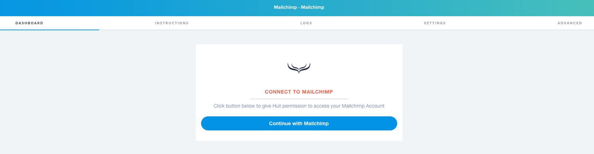
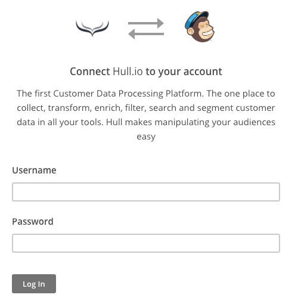
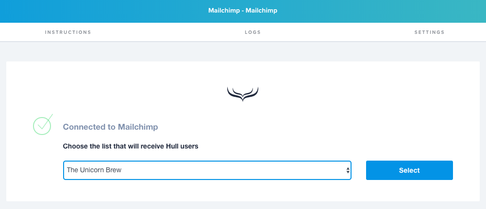
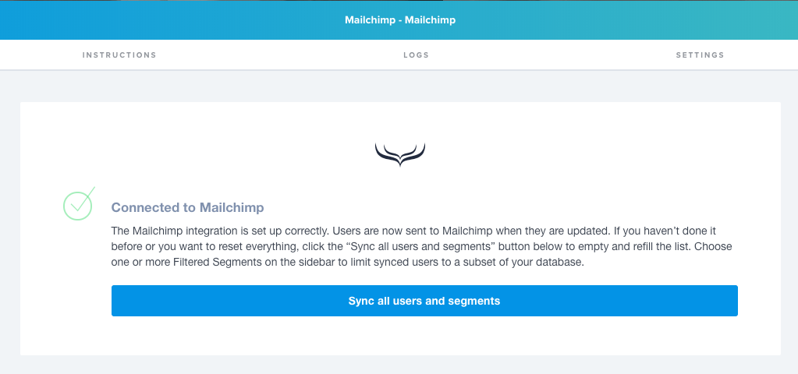
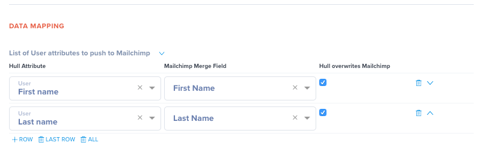
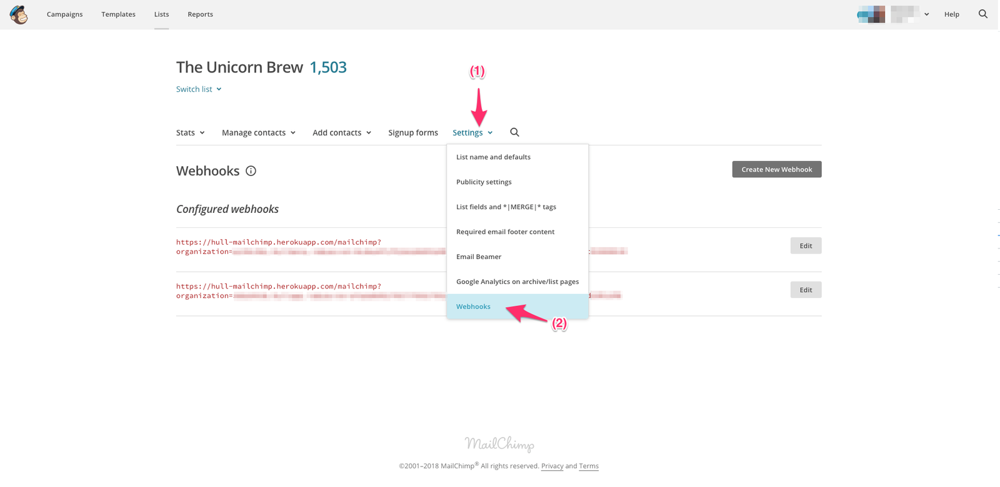
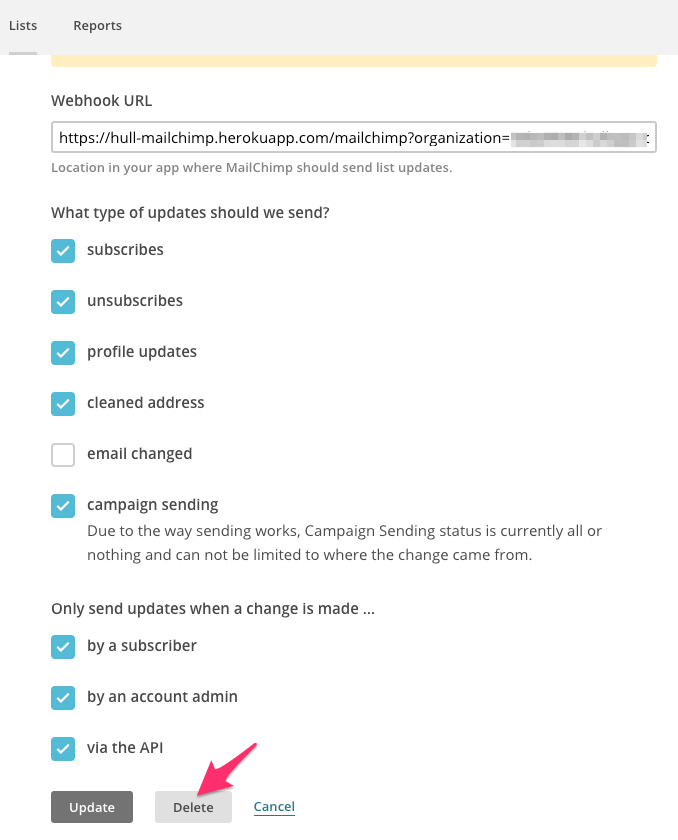
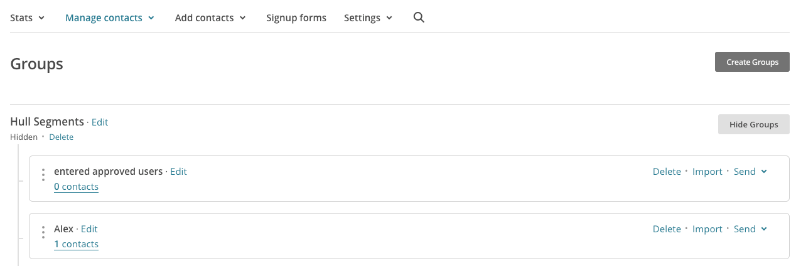

# Mailchimp Connector

The Mailchimp Connector enables your team to synchronize users from Hull with Mailchimp to engage your customers.

## Getting Started

Go to the Connectors page of your Hull organization, click the button “Add Connector” and click “Install” on the Mailchimp card. After installation, stay on the “Dashboard” tab and click on the button “Continue with Mailchimp”:

On the authentication screen, log into Mailchimp with your username and password, if you are not already logged in:

After successful authentication, you will be redirected to the Dashboard screen of the Mailchimp Connector where you need to pick the list with which Hull data is synchronized:

Once you have selected a list, the “Dashboard” tab will indicate that the Connector is ready to synchronize data with Mailchimp:

You have completed the basic setup of the Connector, now it is time to complete additional steps to make the Connector fully operational:

- [Specify which users are synchronized with Mailchimp](#Specify-which-users-are-synchronized-with-Mailchimp)
- [Determine the user attributes to send to Mailchimp](#Determine-the-user-attributes-to-send-to-Mailchimp)

## Features

The Mailchimp Connector allows you to send user attributes from Hull to Mailchimp to engage with your customers. Hull will receive all changes that occurred to users in the synchronized list automatically via webhooks.

The Mailchimp Connector supports  `update traits` and `create events`.

## Specify which users are synchronized with Mailchimp

By default no users are sent to Mailchimp, but you can easily change this behavior in the “Settings” tab of the Connector. Locate the section labelled configuration and select the segments you want to synchronize.  You may also select "All Users" to send all users to Mailchimp

## Determine the user attributes to send to Mailchimp

The Connector sends automatically the email address of the user and all segments as interests to Mailchimp. New users are being created with the status `subscribed` and the `html` email format in Mailchimp. 
All other user attributes can be mapped to merge fields in the section “Data Mapping” of the “Settings” tab as shown below:

The checkbox “Hull overwrites Mailchimp” determines how the Connector behaves in case of a data conflict, if the checkbox is active Hull will always be the leading system and overwrite data in mailchimp. Let us explain this with an example:

| Hull Data                                                 | Mailchimp Data                                             |
| --------------------------------------------------------- | ---------------------------------------------------------- |
| Email: j.doe@hull-demo.io
First Name: John
Last Name: Doe | Email: j.doe@hull-demo.io
First Name: James
Last Name: Doe |

With the checkbox activated for `First Name`, Hull will overwrite the Mailchimp data and update the users first name from James to John. If the checkbox is not checked, the Mailchimp data would not be altered, the user would still have James as first name in Mailchimp.

## Remove webhook registration after deleting the Mailchimp Connector

Deleting the Mailchimp Connector from your Hull organization will not automatically deprovision the webhook from the linked Mailchimp list. You should perform the following steps after removing the Mailchimp Connector to ensure that data is no longer sent from Mailchimp to Hull.

- Navigate to the synchronized list in Mailchimp
- Open the Settings menu and select Webhooks:
  
- Click the “Edit” button next to the webhook you want to delete and select “Delete” on the next screen:
  

## Learn more about the data flow between Hull and Mailchimp

The Hull Mailchimp Connector synchronizes Hull users to the linked list in Mailchimp as members. But it also makes sure that you can leverage Hull’s powerful near real-time segmentation engine by synchronizing the segments as interests and static segments.

Before we look into when segments are synchronized, let us understand how Hull segments and Mailchimp interests match up. After installation, the Mailchimp Connector creates an interest group called `Hull Segments`  for the linked list. Inside this group all Hull segments are stored as interests:

Please note that Mailchimp allows only 60 interests per list, so you can synchronize a maximum of 60 different segments to one list. The Mailchimp Connector always synchronizes all segments as interests even if you have explicitly specified only a couple of segments in the whitelist. 

Beside the matching interest, the Connector creates a static segment for each Hull segment.

Now that you know how Hull synchronizes segments, let us have a closer look when data is synchronized. Generally speaking, Hull will send user data every time a user gets updated (attribute changes or event is tracked). If you have whitelisted segments, synchronization will only take place if the user is at least in one of the whitelisted segments. If the user does no longer belong to any whitelisted segments, it won’t get removed from the list in Mailchimp entirely but it will no longer belong to any static segment.

Let us look at some examples to see how the data flow works.

----------

Organization segments:

- Leads
- Customers - All
- Customers - Active

Whitelisted segments (in the Connector settings):

- Customers - Active

User segments:

- Customers - All

----------

User interacts with the application and the following changes in Hull

| Entered Segments    | Left Segments |
| ------------------- | ------------- |
| - Customer - Active | none          |

----------

Since the user belongs now to one of the whitelisted segments, he gets synchronized to Mailchimp:

| Interests                              | Static Segments                        |
| -------------------------------------- | -------------------------------------- |
| - Customers - All
- Customers - Active | - Customers - All
- Customers - Active |

----------

The Customer Success Team creates two new segments in Hull and adds one to the whitelisted segments:
Organization segments:

- Leads
- Customers - All
- Customers - Active
- Customers - Expanded
- Churn

Whitelisted segments (in the Connector settings):

- Customers - Active
- Customers - Expanded

----------

User purchases a bigger plan, which results in the following changes in Hull

| Entered Segments      | Left Segments |
| --------------------- | ------------- |
| - Customer - Expanded | none          |

----------

The user belongs still to one of the whitelisted segments, so he gets synchronized to Mailchimp:

| Interests                                                    | Static Segments                                              |
| ------------------------------------------------------------ | ------------------------------------------------------------ |
| - Customers - All
- Customers - Active
- Customer - Expanded | - Customers - All
- Customers - Active
- Customer - Expanded |

----------

A couple of months later, the user cancels his subscription which results in the following changes in Hull:

| Entered Segments | Left Segments                                                |
| ---------------- | ------------------------------------------------------------ |
| - Churn          | - Customers - All
- Customers - Active
- Customer - Expanded |

----------

The user is no longer in any synchronized Hull segment which will remove the user from all static segments.
