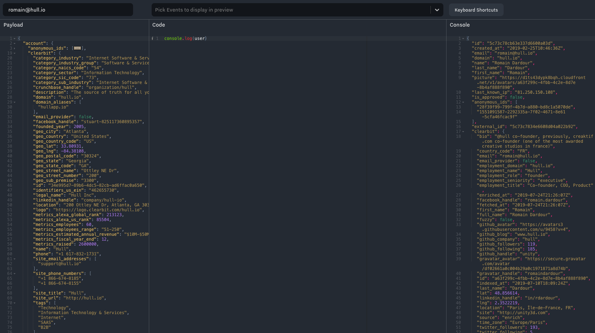

# Hull Processor

The Processor enables you to run your own logic on attributes and events associated to users and leads by writing Javascript.

## Getting Started

Go to the Connectors page of your Hull organization, click the button “Add Connector” and click “Install” on the Processor card. After installation, you will be presented with the three column Dashboard layout. The left column displays the **Input** which is a user with events, segments and attributes, the middle column will hold your Javascript **Code** that transforms it to the **Output** of the right column. The Output itself displays the changed attributes of the user.



You can begin writing your own code right away, but you probably might want to gather some useful background information first. We recommend to start with the [execution model](#Execution-Model) which clarifies when your code is run before you move on to the data that is available as Input:

- [User](#Input---User)
- [Changes](#Input---Changes)
- [Account](#Input---Accounts)
- [Events](#Input---Events)
- [User Segments](#Input---User-Segments)
- [Account Segments](#Input---Account-Segments)

Read more about writing code:

- [Code basics](#Code-basics)
- [External libraries](#External-Libraries)
- [Golden Rules](#Golden-Rules)


## Features

The Hull Processor allows your team to write Javascript and transform data in Hull for users and accounts. You can emit events based of attribute changes or calculate a lead score, the Processor is your multi-tool when it comes to data in Hull.

The Processor can  `add traits`,  `update traits` and `create events` for both, users and accounts. Furthermore it allows you to `link accounts` And add/remove `aliases` for users

You can use the `superagent` library ([https://github.com/visionmedia/superagent](https://github.com/visionmedia/superagent)) to call external services or send data to webhooks.

Async/await and ES6 are supported by the connector, allowing you to write elegant code.

## Execution Model

Before writing your first line of code, it is vital to have a good understanding when this code will be executed:

- The Processor runs on micro-batched data, which means that not every changed attribute and newly added event will lead to a run of the Processor.
- The Processor receives events exactly once, or in other words the exposed events are the ones between now and the last run of the Processor.


## Input - User

The `user` object provides you access to all attributes of the currently computed user. You have access to three different kinds of attributes, top-level, ungrouped and grouped traits.

Top-level attributes are directly accessible via `user.name` for example, while ungrouped attributes are accessible via `user.traits.my_trait` and grouped attributes can be used via `user.salesforce_contact.email`.

You can inspect the user object shown in the Input (left column) to inspect the different attributes of the user. You can search for a particular user in the Input by entering the email address or Hull ID into the search field.

```javascript
    {
      "accepts_marketing": false,
      "anonymous_ids": [
        "1493661119-49ee68ac-1z58-4r3l-n8ba-2x22wb3762g9",
        "intercom:5907854a8ez91d591a49b4c2",
        "hubspot:999999",
        // additional identifiers
      ],
      "created_at": "2017-05-01T19:06:04Z",
      "domain": "hull.io",
      "email": "johnny@hull.io",
      "external_id": "2107091ci8babc17z10017d8",
      "first_name": "John",
      "first_seen_at": "2017-05-01T17:51:52Z",
      "first_session_initial_referrer": "",
      "first_session_initial_url": "http://www.hull.io/",
      "first_session_platform_id": "558979x8v29537a316",
      "first_session_started_at": "2017-05-01T17:51:52Z",
      "has_password": true,
      "id": "5907871cy3bdae94k10017p3",
      "identities_count": 0,
      "is_approved": true,
      "last_known_ip": "8.8.8.8",
      "last_name": "Doe",
      "last_seen_at": "2017-09-25T11:54:50Z",
      "latest_session_initial_referrer": "",
      "latest_session_initial_url": "https://dashboard.hullapp.io/",
      "latest_session_platform_id": "558979x8v29537a316",
      "latest_session_started_at": "2017-09-25T11:53:52Z",
      "main_identity": "external",
      "name": "John Doe",
      "picture": "<URL>", // the gravatar URL
      "signup_session_initial_referrer": "",
      "signup_session_initial_url": "http://www.hull.io/",
      "signup_session_platform_id": "558979x8v29537a316",
      "signup_session_started_at": "2017-05-01T17:51:52Z",
      "traits": {
        "company_name": "Hull Inc",
        "matching_technologies": 3,
        "request_demo": false,
        "unified_domain": "hull.io"
      },
      "hubspot": {
        "created_at": "2017-01-22T18:52:08+00:00",
        "email_optout": "",
        "hs_sales_email_last_opened": "1495839471456",
        "hubspot_owner_id": "9999999",
        "id": 999999,
        "owner_assigned_at": "2017-01-22T18:52:08+00:00",
        "updated_at": "2017-05-26T22:57:56+00:00"
      }
      "intercom": {
        "anonymous": false,
        "avatar": "<URL>", // URL for avatar
        "companies": [ "Hull" ],
        "created_at": "2017-05-01T18:58:23+00:00",
        "id": "5907854x5ze61g395b10b3d7",
        "last_request_at": "2017-09-21T10:52:30+00:00",
        "last_seen_ip": "8.8.8.8",
        "location_city_name": "Atlanta",
        "location_continent_code": "US",
        "location_country_code": "USA",
        "location_country_name": "United States",
        "location_latitude": 10.0833,
        "location_longitude": 10.9167,
        "location_postal_code": "30305",
        "location_region_name": "Georgia",
        "location_timezone": "America/NewYork",
        "name": "John Doe",
        "pseudonym": "Amber Turtle from Atlanta",
        "segments": [],
        "session_count": 416,
        "signed_up_at": "2017-05-01T19:06:04+00:00",
        "tags": [],
        "unsubscribed_from_emails": false,
        "updated_at": "2017-09-25T08:07:39+00:00"
      },
      "salesforce_lead": {
        "company": "Hull Inc",
        "email": "johnny@hull.io",
        "first_name": "John",
        "id": "00Z39100002XipQXZZ",
        "last_name": "Doe",
        "owner_id": "09315080000TSgjBAM",
        "pi__campaign__c": "Segmentation Checklist",
        "status": "New"
      },
      "indexed_at": "2017-09-25T11:54:58+00:00",
      "segments": [
        {
          "id": "56a7904e8d3714a04c0000da",
          "name": "Active Users",
          "type": "users_segment",
          "created_at": "2016-01-26T15:27:10Z",
          "updated_at": "2016-01-26T15:27:10Z"
        },
        // skipped
        ]
    }
```

## Input - Changes

The `changes` object represents all changes to a user that triggered the execution of this processor and contains information about all modified data since the last re-compute of the user. Changes itself is an object in Javascript which exposes the following top-level properties:

- `changes.is_new` indicates whether the user created is new and has just been created or not.
- `changes.segments`, which holds all segments the user has entered and left since the last recompute, accessible via `changes.segments.entered` and `changes.segments.left`. Each segment is an object itself composed of the following properties `created_at` , `id`, `name`, `type`and `updated_at`.
- `changes.account_segments`, which holds all account segments the Account has entered and left since the last recompute, accessible via `changes.account_segments.entered` and `changes.account_segments.left`. Each segment is an object itself composed of the following properties `created_at` , `id`, `name`, `type`and `updated_at`.
- `changes.user` which is an object that exposes each changed attribute as a property. The property value is an array which has the old value as the first argument and the new one as the second. For example, if the email is set the first time, you can access it via `changes.user.email` and the value will look like this `[null, "test@hull.io"]`.
- `changes.account` which is an object that is exposes each changed attribute as property whose value is an array. The array has the old value as the first argument and the new one as the second. For example, if the email is set the first time, you can access it via `changes.account.domain` and the value will look like this `[null,"www.hull.io"]`

The following code shows an example of changes:

```javascript
    {
      changes: {
        is_new: false,
        segments: {
          entered: [
            {
              created_at: "2017-09-01 09:30:22.458Z",
              id: "dfbdd69d-1e6d-4a58-8031-c721a88f71f6",
              name: "All Leads",
              type: "user",
              updated_at: "2017-09-01 10:04:01.938Z",
            },
            // more segments if applicable
          ],
          left: [
            // omitted for brevity
          ]
        },
        account_segments: {
          entered: [
            {
              created_at: "2017-09-01 09:30:22.458Z",
              id: "dfbdd69d-1e6d-4a58-8031-c721a88f71f6",
              name: "All Accounts",
              type: "account",
              updated_at: "2017-09-01 10:04:01.938Z",
            },
            // more segments if applicable
          ],
          left: [
            // omitted for brevity
          ]
        },
        user: {
          newsletter_subscribed: [false, true],
          first_name: [null, "John"],
          last_name: [null, "Doe"]
        }
        account: {
          name: [null, "Hull"],
          domain: [null, "www.hull.io"],
          mrr: [null, "500"]
        }
      }
    }
```


## Input - Account

The account object consists of a nested trait hierarchy in contrast to the user object in Hull. This means you can access all traits directly by their name, e.g. to get the name of an account, just use `account.name` in the code.
Accounts do have various identifiers: the Hull ID (`account.id`), an External ID (`account.external_id` ) and Domain (`account.domain`).
The following snippet shows an example of an account:

```javascript
    {
      account: {
        id: "7ad5524d-14ce-41fb-8de4-59ba9ccf130a",
        external_id: "8476c4c7-fe7d-45b1-a30d-cd532621325b",
        domain: "hull.io",
        name: "Hull Inc.",
        clearbit: {
          name: "Hull Inc."
        },
        ... // more attributes in nested hierarchy
      },
      [...] // omitted for clarity
    }
```

Please note that the `external_id` is only present if the account has been created via another connector such as the SQL importer or Segment.


## Input - Events

The `events` object holds all events that have occurred since the last re-compute of the user. It is an array of objects, that has a couple of key attributes as explained below. You shouldn’t rely on the fact that these attributes are present for every event.

The `event.event` attribute holds the name of the event itself while `event.event_source` and `event.event_type` provide you some information where the event came from and what type the event is of. The `event.context` property provides you data about the environment of the event, such as the url, session and timestamp. The `event.properties`  of the event provide you access to all attributes of the event. Both, `event.context`  and `event.properties`, depend heavily on the event, so you should code defensively when accessing this data.

The following code shows an example payload of events:

```javascript
    {
      "events": [
        {
          "event": "Viewed ships",
          "created_at": "2017-09-18T12:18:04Z",
          "properties": {
            "action": "PUSH"
          },
          "event_source": "track",
          "event_type": "track",
          "context": {
            "location": {
              "latitude": 99,
              "longitude": 99
            },
            "page": {
              "url": "https://dashboard.hullapp.io/super/ships"
            }
          }
        }
      ]
    }
```

## Input - User Segments

You can access the segments a user belongs to via `segments` which is an array of objects itself. Each segment object has an identifier and name that can be accessed via `id` and `name` and metadata such as `type`, `updated_at` and `created_at`.

The following code shows an example of the `segments` data:

```javascript
    {
      "segments": [
        {
          "id": "59b14b212fa9835d5d004825",
          "name": "Approved users",
          "type": "users_segment",
          "updated_at": "2017-09-07T13:35:29Z",
          "created_at": "2017-09-07T13:35:29Z"
        },
        {
          "id": "5995ce9f38b35ffd2100ecf4",
          "name": "Leads",
          "type": "users_segment",
          "updated_at": "2017-08-17T17:13:03Z",
          "created_at": "2017-08-17T17:13:03Z"
        },
        // additional segments
      ]
    }
```

## Input - Account Segments

You can access the segments for the Account a user belongs to via `account_segments` which is an array of objects itself. Each segment object has an identifier and name that can be accessed via `id` and `name` and metadata such as `type`, `updated_at` and `created_at`.

The following code shows an example of the `account_segments` data:

```javascript
    {
      "account_segments": [
        {
          "id": "59b14b212fa9835d5d004825",
          "name": "Approved users",
          "type": "users_segment",
          "updated_at": "2017-09-07T13:35:29Z",
          "created_at": "2017-09-07T13:35:29Z"
        },
        {
          "id": "5995ce9f38b35ffd2100ecf4",
          "name": "Leads",
          "type": "users_segment",
          "updated_at": "2017-08-17T17:13:03Z",
          "created_at": "2017-08-17T17:13:03Z"
        },
        // additional segments
      ]
    }
```


## Code basics

You can access the **input data** as described above, here is the summary of available Javascript objects:

| Variable Name                      | Description                                                                    |
| ---------------------------------- | ------------------------------------------------------------------------------ |
| `user`                             | Provides access to the user’s attributes.                                      |
| `account`                          | Provides access to the account’s attributes.                                   |
| `changes`                          | Represents all changes in user attributes since the last re-computation.       |
| `events`                           | Gives you access to all events **since the last re-computation.**                  |
| `segments`                         | Provides a list of all segments the user belongs to |
| `account_segments`                 |  Provides a list of all account segments the user's Account belongs to |

Please note that some of the input data shown on the left might be fake data that showcases additional fields available in your organization but that might not be applicable to all users.

In addition to the input, you can also access the **settings** of the processor:

|**Variable Name**| **Description**                                                                                                                                                |
|-----------------| ---------------------------------------------------------------------------------------------------------------------------------------------------------------|
|`connector`           | Provides access to processor settings, e.g. `connector.private_settings` gives you access to the settings specified in `manifest.json` as shown in the Advanced tab.|
|`variables`           | Provides the values that you can store in the `Settings` tab of the connector. Usually to avoid storing Access Keys in the code itself |

Now that you have a good overview of which variables you can access to obtain information, let’s move on to the functions that allow you to **manipulate data**.

## How to set User / Account attributes

Lets first explore how you can **change attributes for a user**. As you already know from the Input - User section above, there are three types of attributes, top-level, ungrouped and grouped attributes. ***Top-level and ungrouped attributes*** can be set with the not-overloaded function call

```javascript
  hull.traits({ ATTRIBUTE_NAME: <value> })
```

For naming conventions, see the Golden Rules section below.

Of course you can set multiple attributes at once by passing a more complex object like:

```javascript
  hull.traits({ ATTRIBUTE_NAME: <value>, ATTRIBUTE2_NAME: <value> })
```

Using this function signature, these attributes are stored at the top level for the target User (or Account)

### Attribute Groups

If you want to make use of ***grouped attributes***, you can use the overloaded signature of the function, passing the group name as source in the second parameter:

```javascript
  hull.traits({ bar: "baz" }, { source: "foo" })
```

Alternatively, you can pass the fully qualified name for the grouped attribute. Those two signatures will have the same results

```javascript
  hull.traits({ "foo/bar": baz });
```

If you want to “delete” an attribute, you can use the same function calls as described above and simply set `null`  as value.

```javascript
  hull.traits({ foo: null });
```


### Incrementing and decrementing values (Atomic Operations)

Given the distributed nature of computation, if you want to increment or decrement a counter, you need to take special care. Since the code might run multiple times in parallel, the following operation will not be reliable:

_DO NOT DO THIS_:

```javascript
  hull.traits({ coconuts: user.coconuts+1 });
```

To get reliable results, you need to use `atomic operations`. Here's the correct way to do so:

_DO THIS INSTEAD_:

```javascript
 hull.traits({ coconuts: { operation: 'inc', value: 1 } })
```

Where:
- Operation: `inc`, `dec`, `setIfNull`
- Value: The value to either increment, decrement or set if nothing else was set before.

## How to track events

Now that we know how to handle attributes, let’s have a look at how to **emit events for a user**. You can use the `hull.track` function to emit events, but before we go into further details be aware of the following:

_The `hull.track` call needs to be always enclosed in an `if` statement and we put a limit to maximum 10 tracking calls in one processor. If you do not follow these rules, you could end up with a endless loop of events that counts towards your plan quota._

Here is how to use the function signature:

```js
  hull.track( "<event_name>" , { PROPERTY_NAME: <value>, PROPERTY2_NAME: <value> })
```

The first parameter is a string defining the name of the event while the second parameter is an object that defines the properties of the event.


## How to alias / unalias identifiers

You can add or remove aliases to the processed user with the following syntax:

```js
  hull.alias({ anonymous_id: "foobar:1234" });
  hull.unalias ({ anonymous_id: "foobar:1234" });
```

## How to link Users to Accounts

Now that we know how to deal with users, let’s have a look how to handle accounts.

You can **link an account to the current user** by calling the `hull.account` function with claims that identify the account. Supported claims are `domain`, `id` and `external_id`. To link an account that is identified by the domain, you would write

```js
  const claims_object = { domain: <value> }
  hull.account(claims_object)
```
which would either create the account if it doesn’t exist or link the current user to the existing account.

## How to edit attributes for the account

To **change attributes for an account**, you can use the chained function call `hull.account(CLAIMS_OBJECT).traits()`. If the user is already linked to an account, you can skip passing the claims object in the `hull.account(CLAIMS_OBJECT)`  function and the attributes will be applied to the current linked account. By specifying the claims, you can explicitly address the account and if it is not linked to the current user, the account will be linked and attributes will be updated.
In contrast to the user, accounts do only support top-level attributes. You can specify the attributes in the same way as for a user by passing an object into the chained `traits` function like

> NOTE: be careful when doing this as every User in the account will be sent to the processor, and will run this logic. You could easily end up with infinite loop where each User updates the same Account back and forth, with different values. A better way to update account data is to use the Accounts processor.

```js
  const accountExternalId = account.external_id.
  const accountDomain = account.domain.
  hull
    .account({ domain: accountDomain, external_id: accountExternalId })
    .traits({ ATTRIBUTE_NAME: <value>, ATTRIBUTE2_NAME: <value> })
```

### Limitations

The Platform refuses to associate Users in accounts with a domain being a Generic Email Domain - See the list of email domains we refuse here: https://github.com/smudge/freemail/tree/master/data  - This helps preventing accounts with thousands of users under domains like `gmail.com` because you'd have written the following code:

```js
 // Any user with a "gmail.com" account would be linked to this account
 hull.account({ domain: user.domain })
```

### Understanding the logic behind Accounts, Preventing Infinite Loops

Let's review a particularly critical part of Accounts:

Here's a scenario that, although it seems intuitive, will **generate an infinite loop** (which is bad. You don't want that). Let's say you store the MRR of the account at the User level and want to use Hull to store it at account level. Intuitively, you'd do this:

```js
  hull
    .account(CLAIMS_OBJECT) //target the user's current account
    .traits({
      //set the value of the 'is_customer' attribute to the user's value
      mrr: user.traits.mrr
    })

```

Unfortunately, it's enough for 2 users in this account to have different data to have the account go into an infinite loop:

```
User1 Update
  → Set MRR=100
    → Account Update
      → User2 Update
        → Set MRR=200
          → Account Update
            → User Update
              → Set MRR=100 → Account Update
etc...
```

The way you solve this is by either doing a `setIfNull` operation on the account, so that the first user with a value defines the value for the account and it's not updated anymore, or you rely on the `changes` object to only change the Account when the value for the user changed:

```js
  const mrr = _.get(changes, 'user.traits.mrr')
  //There was an MRR change on the User
  if(mrr && mrr[1]) {
    //report the new MRR on the Account
    hull.account(CLAIMS_OBJECT).traits({ mrr: mrr[1] });
  }
```

Or you could rely on a User Event if you have such events"

```js
events.map(event => {
  if (event.event === "MRR Changed") {
    hull.account(CLAIMS_OBJECT).traits({ mrr: event.properties.mrr });
  }
});
```

## Utility Methods
The processor provides the following methods to help you:

| **Function Name**                                  | **Description**                                                                                                                                                                                                                                                                        |
| ---------------------------------------------------| ---------------------------------------------------------------------------------------------------------------------------------------------------------------------------------------------------------------------------------------------------------------------------------------|
| `isInSegment(<name>)`                              | Returns `true` if the user is in the segment with the specified name; otherwise `false`. Please note that the name is case-sensitive.                                                                                                                                                  |
| `isInAccountSegment(<name>)`                              | Returns `true` if the user's account is in the segment with the specified name; otherwise `false`. Please note that the name is case-sensitive.                                                                                                                                                  |
| `enteredSegment(<name>)`                              | Returns the segment object if the user just entered the segment with the specified name; otherwise `null`. Please note that the name is case-sensitive.                                                                                                                                                  |
| `enteredAccountSegment(<name>)`                              | Returns the segment object if the user's Account just entered the segment with the specified name; otherwise `null`. Please note that the name is case-sensitive.                                                                                                                                                  |
| `leftSegment(<name>)`                              | Returns the segment object if the user just left the segment with the specified name; otherwise `null`. Please note that the name is case-sensitive.                                                                                                                                                  |
| `leftAccountSegment(<name>)`                              | Returns the segment object if the user's Account just left the segment with the specified name; otherwise `null`. Please note that the name is case-sensitive.                                                                                                                                                  |
| `setIfNull(value)`                              | A Helper to send a `setIfNull` command for the specified attribute. Use like this: hull.traits({ foo: setIfNull(1234) }).                                                                                                                                                  |

## External Libraries

The processor exposes several external libraries that can be used:

|**Variable**          | **Library name**                                                                        |
|----------------------| ----------------------------------------------------------------------------------------|
|`_`                   | The lodash library. (https://lodash.com/)                                               |
|`moment`              | The Moment.js library(https://momentjs.com/)                                            |
|`urijs`               | The URI.js library (https://github.com/medialize/URI.js/)                               |
|`request` (deprecated)| The simplified request client (https://github.com/request/request)                      |
|`superagent`          | The simple and elegant request library (https://github.com/visionmedia/superagent)      |
|`uuid`                | The uuid library (https://github.com/uuidjs/uuid)                                       |
|`LibPhoneNumber`      | The google-LibPhoneNumber library (https://ruimarinho.github.io/google-libphonenumber/) |

Please visit the linked pages for documentation and further information about these third party libraries.

### uuid Library

The `uuid` library exposes the version 4 of the algorithm, and only accepts the first `options` argument - other arguments will be ignored. As a result, here's the way to use it:

```js
const user_id = uuid()
//or
const user_id = uuid({ random: [ 0x10, 0x91, 0x56, 0xbe, 0xc4, 0xfb, 0xc1, 0xea, 0x71, 0xb4, 0xef, 0xe1, 0x67, 0x1c, 0x58, 0x36, ] });
```

### LibPhoneNumber Library

The `LibPhoneNumber` library exposes a subset of the `google-libphonenumber` library. Here's how to use it

```js
//PhoneNumberFormat is the PhoneNumberFormat object from the library;
//PhoneNumberUtil is an INSTANCE of the PhoneNumberUtil methods
const { CountrySourceCode, PhoneNumberType, PhoneNumberFormat, PhoneNumberUtil } = LibPhoneNumber;

const number = PhoneNumberUtil.parseAndKeepRawInput('202-456-1414', 'US');
console.log(number.getCountryCode()); //1
// Print the phone's national number.
console.log(number.getNationalNumber());
// => 2024561414

// Result from isPossibleNumber().
console.log(PhoneNumberUtil.isPossibleNumber(number));
// => true
```

### Supported Methods for `PhoneNumberUtil`

Checkout `i18n.phonenumbers.PhoneNumberUtil`: https://ruimarinho.github.io/google-libphonenumber/#google-libphonenumber-methods-i18nphonenumbersphonenumberutil

Calling `PhoneNumberUtil.parse("1234-1234")` will return an instance of `PhoneNumber`, which has the following methods: https://ruimarinho.github.io/google-libphonenumber/#google-libphonenumber-methods-i18nphonenumbersphonenumber

Checkout the Docs for `CountryCodeSource`, `PhoneNumberFormat`, `PhoneNumberType` which are statics

## \[Deprecated\] Using Request

The request library is now deprecated. Processors using the request library will be still operational,
but we advise you to migrate to the super-agent request library which is much more intuitive and elegant to use.

If you are about to write new code to perform any API request, please refer to the [Using Superagent](#Using-Superagent) section.

The library exposes `request-promise` to allow you to call external APIs seamlessly:

```javascript
const response = await request({
    uri: 'https://api.github.com/user/repos',
    qs: {
        access_token: 'xxxxx xxxxx' // -> uri + '?access_token=xxxxx%20xxxxx'
    },
    headers: {
        'User-Agent': 'Request-Promise'
    },
    json: true // Automatically parses the JSON string in the response
})
console.log(response)
```

## Using Superagent

To perform API requests, the processor connector exposes the superagent library through the `superagent` keyword.
It is an instance of the original [superagent](https://visionmedia.github.io/superagent/) library with additional plugins added behind the scenes to make it run smoothly in your processor code.
This comes with some syntax restrictions that our instance of superagent won't work with, more on that right below.

### Differences

The exposed superagent instances cannot be called as function, so following code won't work:

```javascript
const res = await superagent('GET', 'https://www.foobar.com/search');
```

Instead always call a method on superagent object choosing which HTTP method you want to use. See examples Below.

### Usage

Here are a few code snippets to use the super-agent request library in your processor code:

```javascript
const response = await superagent
    .get("https://example.com/foo")
    .set("accept", "json")                    // Set a header variable by using the set() function.
    .set(`Authorization: Bearer ${api_key}`)
    .send({                                   // Set a body by using the send() function
      body_variable: "something"              // and by giving it an object.
    })
    .query({                                  // Set a query by using the query() function
      orderBy: "asc"                          // and by giving it an object.
    })
```

You can also perform asynchronous requests by using promises as such:

```javascript
superagent
    .get("https://example.com/foo")
    .set("accept", "json")
    .set(`Authorization: Bearer ${api_key}`)
    .send({
      body_variable: "something"
    })
    .query({
      orderBy: "asc"
    })
    .then(res => {
      console.log(res.body);
    })
```

Handling errors is also possible, either by using promises or by wrapping the code in a `try catch` statement:

```javascript
superagent
    .get("https://example.com/foo")
    .set("accept", "json")
    .set(`Authorization: Bearer ${api_key}`)
    .then(res => {
      console.log(res.body);
    })
    .catch(err => {
      console.log(`Error: ${err}`);
    })
```

```javascript
try {
  const response = await superagent
    .get("https://example.com/foo")
    .set("accept", "json")
    .set(`Authorization: Bearer ${api_key}`);
} catch (err) {
  console.log(`Error: ${err}`);
}
```

You can find full documentation of the superagent library [here](https://visionmedia.github.io/superagent/).
Keep in mind that calling superagent as function does not work.

### Migrating from the Request library to the Superagent library

You might have noticed a warning message coming on your processor saying that your code is using a deprecated request library.
In order to fix that, you need to replace `request` with the superagent library.

There are mostly two things to adjust. First you need to replace your request options object with set of chained methods on superagent instance.
Second you will need to look for the `response.body` object instead of looking directly at the `data` object.

To illustrate that, let's have a look at a code block using the deprecated request library, and another code block with the result of migrating it.

```javascript
// Old request library

const reqOpts = {
  method: "GET",
  uri: "http://www.omdbapi.com/?t=James+Bond"
};

return new Promise((resolve, reject) => {
    request(reqOpts, (err, res, data) => {
      if (err) {
        console.info("Error:", err);
        return reject(err);
      }
      // data contains the response body
      if(_.isString(data)) {
        data = JSON.parse(data);
      }
      resolve(data);
    });
});
```

```javascript
// With super-agent library

return superagent
    .get("http://www.omdbapi.com/?t=James+Bond")
    .then(res => {
      // res.body is parsed response body
      return res.body;
    })
    .catch(err => {
      console.info("Error:", err);
    })
```

## Golden Rules

- DO use snake_case rather than camelCase in your naming.
- DO write human readable keys for traits. Don’t use names like `ls` for lead score, just name it `lead_score`.
- DO use `_at` or `_date` as suffix to your trait name to let hull recognize the values as valid dates. You can pass either
  - a valid unix timestamp in seconds or milliseconds or
  - a valid string formatted according to ISO-8601
- DO make sure that you use the proper type for new traits because this cannot be changed later. For example, if you pass `"1234"` as the value for trait `customerId`, the trait will be always a treated as string, even if you intended it to be a number.
- DO NOT write code that generates dynamic keys for traits
- DO NOT use large arrays because they are slowing down the compute performance of your data. Arrays with up to 50 values are okay.
- DO NOT create infinite loops because they count towards the limits of your plan. Make sure to guard emitting events with `track` calls and to plan accordingly when setting a trait to the current timestamp.

## Debugging and Logging

When operating you might want to log certain information so that it is available for debugging or auditing purposes while other data might be only of interest during development. The processor allows you to do both:

- `console.log` is used for development purposes only and will display the result in the console of the user interface but doesn’t write into the operational logs.
- `console.info` is used to display the result in the console of the user interface and does also write an operational log.

You can access the operational logs via the tab “Logs” in the user interface. The following list explains the various log messages available:

| **Message**                | **Description**                                                                                                                                                                                                               |
| -------------------------- | ----------------------------------------------------------------------------------------------------------------------------------------------------------------------------------------------------------------------------- |
| `compute.console.info`     | The manually logged information via `console.info`.                                                                                                                                                                           |
| `incoming.user.success`    | Logged after attributes of a user have been successfully computed.                                                                                                                                                            |
| `incoming.account.success` | Logged after attributes of an account have been successfully computed.                                                                                                                                                        |
| `incoming.account.link`    | Logged after the user has been successfully linked with an account.                                                                                                                                                           |
| `incoming.user.error`      | Logged if an error is encountered during compute. The data of the error provides additional information whether the error occurred in the sandboxed custom code or in the processor itself (see boolean value for `sandbox`). |
