# Hull Salesforce Connector

The Salesforce Connector enables your team to sync Hull’s user profile data from and to your Salesforce system.
Fetch, create and update Leads, Contacts and Companies based on our Hull Users and Account data.

## Getting Started

Go to the Connectors page of your Hull organization, click the button “Add Connector” and click “Install” on the Salesforce card. After installation, click "Credentials" button to grant the Connector access to your Salesforce system. Please note that you connect to your Production Environment by default. If you want to connect to a Sandbox Environment, please follow the steps under [Connect with a Sandbox Environment](#connect-with-a-sandbox-environment) before you click on “Continue with Salesforce:

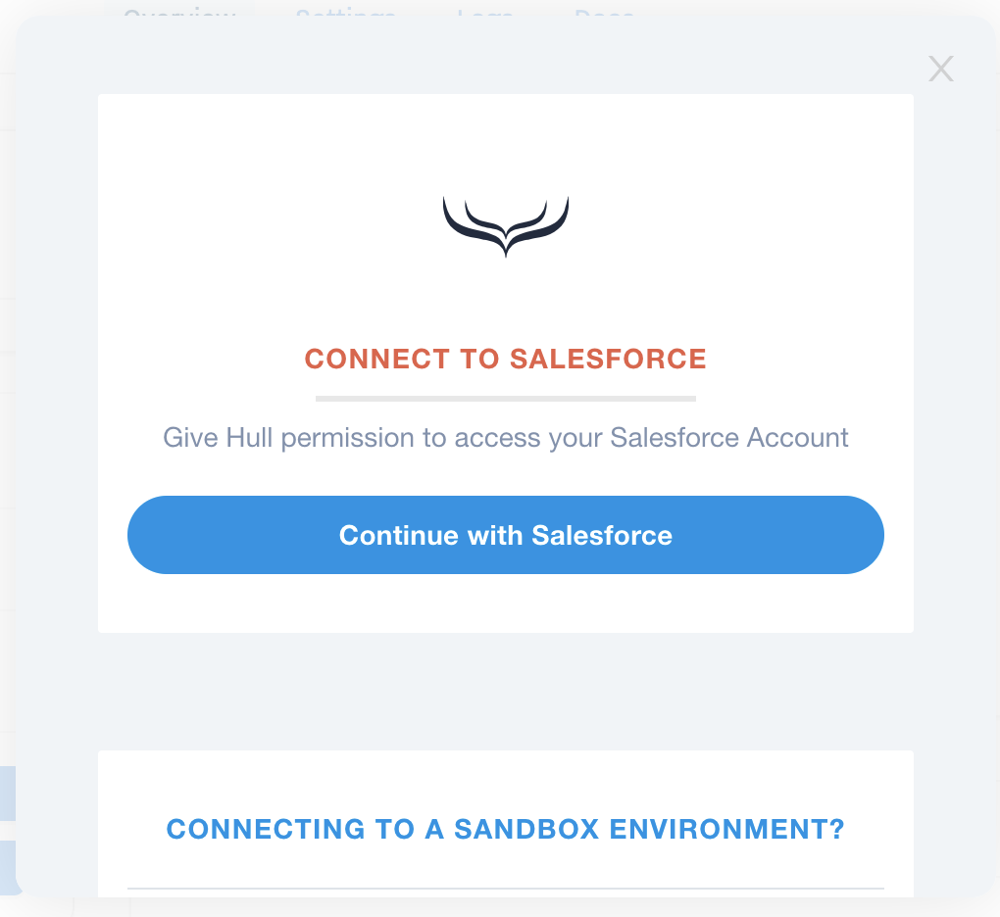

You will get redirected to the login screen of Salesforce. Authenticate the request on the Salesforce website with your username and password:
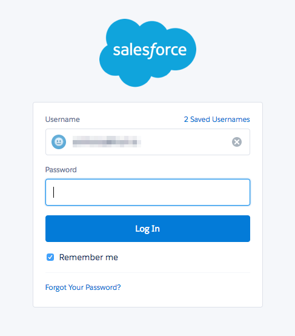

After successful authentication you will be redirected to your Salesforce connector on Hull. You are now ready to complete your setup:
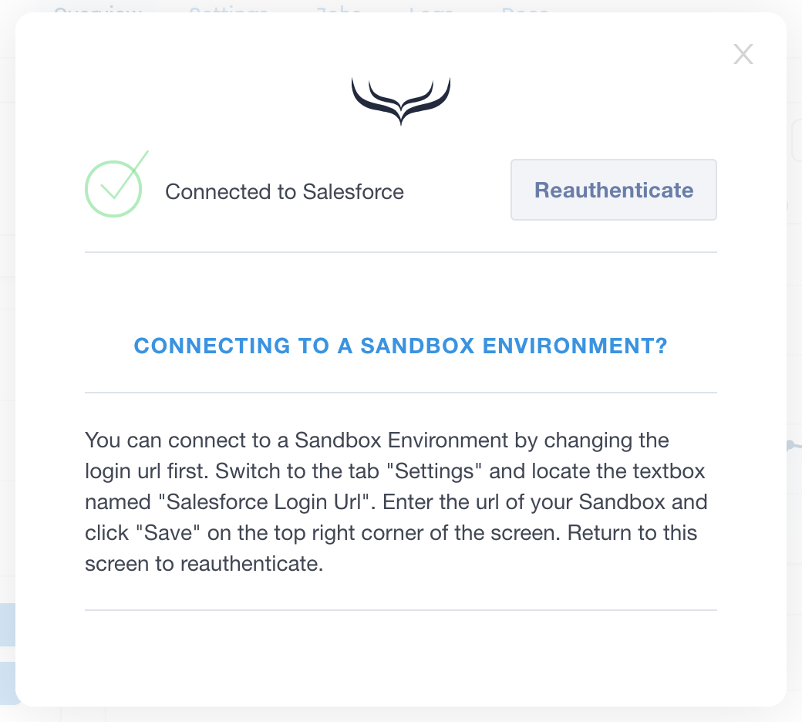

Please refer to following sections to

- [Specify the users who are getting synchronized](#specify-the-users-who-are-getting-synchronized)
- [Determine the attributes to synchronize for Leads](#determine-the-attributes-to-synchronize-for-leads)
- [Determine the attributes to synchronize for Contacts](#determine-the-attributes-to-synchronize-for-contacts)
- [Learn how Hull determines if a user is a Lead or Contact](#learn-how-hull-determines-if-a-user-is-a-lead-or-contact)

## Features

The Hull Salesforce Connector allows your organization to synchronize leads, contacts and accounts from and to our platform. Once you have your data in Hull, you can send it to other tools to keep your entire stack in sync.

The Salesforce connector supports to `create users`, `add attributes` and `update attributes`.

## Specify the Users who are getting synchronized

The Salesforce Connector fetches updates for all leads and contacts from Salesforce automatically.
By default no users are sent from Hull to Salesforce, you need to customize this behavior first and explicitly define the lead and contact segments who will determine how Salesforce handles user and account data from Hull. Go to the “Settings” tab of the connector and locate the section "Users - Sending Leads to Salesforce" for leads and "Users - Sending Contacts to Salesforce" for Contacts. Specify the segments in the following field:

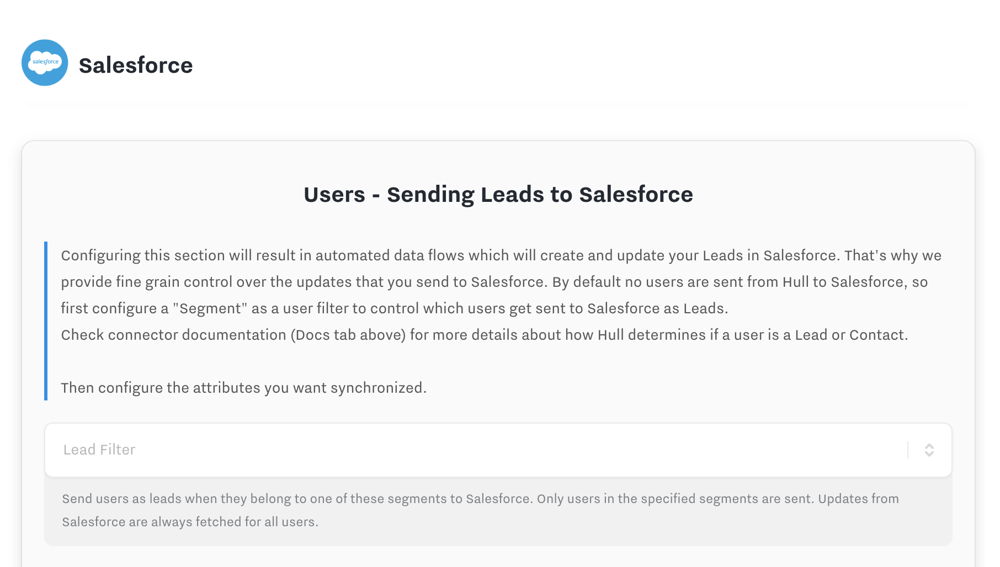

## Determine the Attributes to synchronize for Leads

You can customize the attributes which are getting synchronized with Salesforce Leads, separately for fields we fetch and send back.

The first list determines the attributes Hull fetches from Salesforce. You find it under "Users - Fetching Leads from Salesforce" section in the "Settings". Salesforce data will always take precedence over data in Hull and update the user’s respective attributes. Hull saves the data obtained from Salesforce in the attribute group “Salesforce Lead”, so no standard attribute data will be overwritten.
Please see [Attributes mapping best practises](#attributes-mapping-best-practises) below for further details.

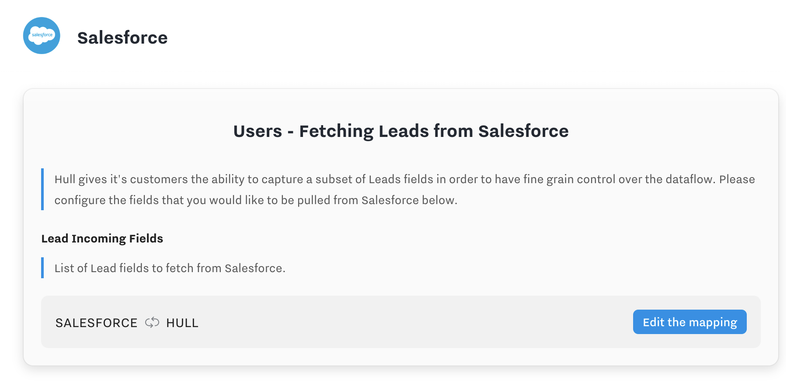

The second list determines which attributes are sent from Hull to Salesforce. You can find it under "Users - Sending Leads to Salesforce" section in the "Settings". Please make sure that this list contains all required attributes to create or update a lead in your Salesforce system. For each attribute, you can specify whether a field in Hull takes precedence over a field in Salesforce by turning on the "OVERWRITE" toggle next to the mapped attribute. If the toggle is set to "OVERWRITE", the field from Hull will always update the field in the Lead record. If the toggle is set to "SET IF NULL", the attribute in Salesforce will only be updated if it has not previously been set.

## Determine the Attributes to synchronize for Contacts

You can customize the attributes which are getting synchronized with Salesforce Contacts, separately for fields we fetch and send back.

The first list determines the attributes Hull fetches from Salesforce. You find it under "Users - Fetching Contacts from Salesforce" section in the "Settings". Salesforce data will always take precedence over data in Hull and update the user’s respective attributes. Hull saves the data obtained from Salesforce in the attribute group “Salesforce Contact”, so no standard attribute data will be overwritten.
Please see [Attributes mapping best practises](#attributes-mapping-best-practises) below for further details.

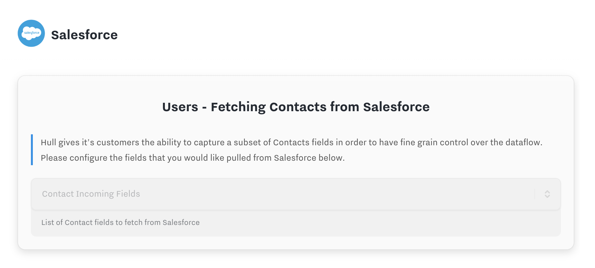

The second list determines which attributes are sent from Hull to Salesforce. You can find it under "Users - Sending Contacts to Salesforce" section in the "Settings". Please make sure that this list contains all required attributes to create or update a contact in your Salesforce system. For each attribute, you can specify whether a field in Hull takes precedence over a field in Salesforce by turning on the "OVERWRITE" toggle next to the mapped attribute. If the toggle is set to "OVERWRITE", the field from Hull will always update the field in the Contact record. If the toggle is set to "SET IF NULL", the attribute in Salesforce will only be updated if it has not previously been set.

## Fetch Tasks into Hull as Events

Salesforce Tasks will be imported into Hull as Hull Events manually or on a schedule. Users can manually fetch all tasks in their Salesforce instance by going to the Overview tab of the Salesforce connector, clicking the "Actions" button, and then "Fetch All Tasks". Tasks can also be fetched by Hull on a 5 minute schedule by turning on the toggle "Fetch Tasks" in the Salesforce connector settings. The "Fetch All Tasks" button will fetch tasks whether or not this toggle is on or off. Hull will fetch all default fields on a Task as properties of the Hull Event.

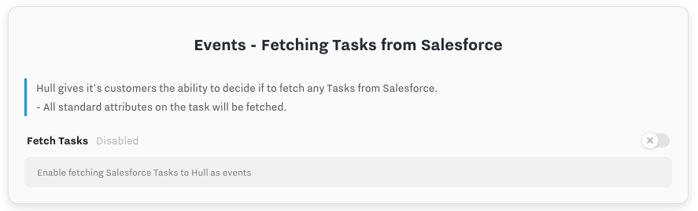

## Send Hull Events to Salesforce as Tasks

Hull Events can be sent to Salesforce as newly created Tasks. To get started, follow the steps below:

1) Create a unique, external id field on the Task object in your Salesforce instance that we will use to store the id of the Hull Event. This will guarantee that the Hull Event and the Salesforce Task will remain in sync. If that field is ever removed or updated after a Task
    has been exported to Salesforce, the Task will be imported back into Hull as a separate and new event, given that 'Fetch Tasks' is turned on.

2) In your Salesforce connector settings, select your newly created unique, external id field as the "Salesforce External ID".
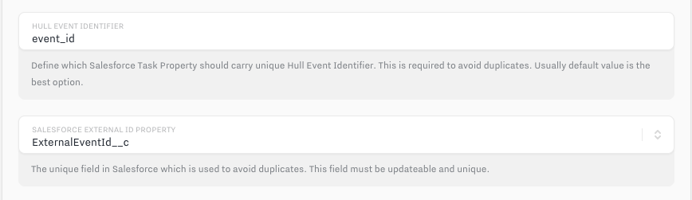

3) Specify which events you would like to send to Salesforce and the type of Task to create. The type of Task must be a valid type, given your Task Type field configuration
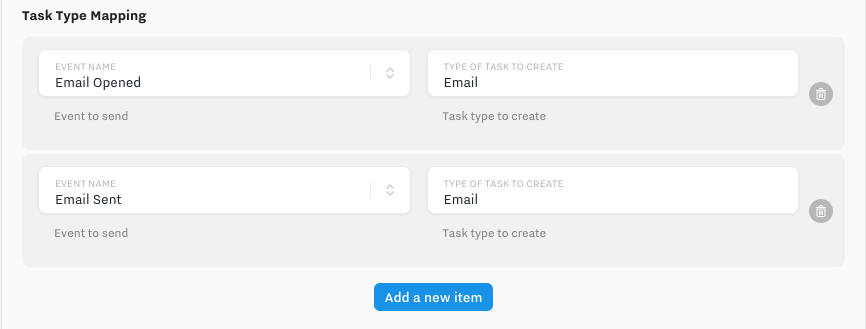

4) Map the id of the contact or lead as stored in Hull to the associated contact or lead of the Task.
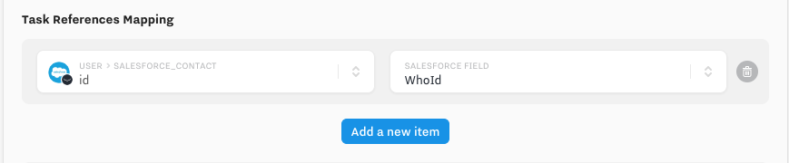

5) Map the properties or context fields of the Hull Event to any modifiable field on the Task.
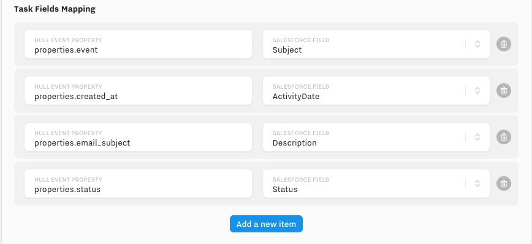

6) Turn on the toggle "Send Events"
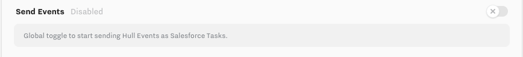

## Connect with a Sandbox Environment

You can configure the Connector to connect to a specific Sandbox system. Go to the tab “Settings” and locate the field “Salesforce Login Url” under the section “Advanced”. Enter the login url of your Sandbox environment here and click “Save” to persist your changes.
Switch to the tab "Overview" and click on "Credentials" to authenticate against your Sandbox system; the steps to authenticate are described in [Getting Started](#getting-started).
#### IMPORTANT - The existing api endpoints do not support any lightning.force.com formatted urls.  A sandbox url, could be either of the following formats: https://test.salesforce.com or https://[yoursalesforceinstancename].my.salesforce.com
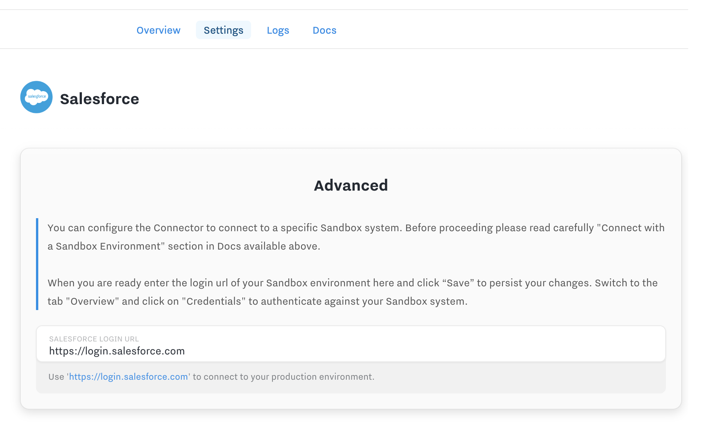
Note: If you want to authenticate against your production environment, change this setting back to `https://login.salesforce.com` and click “Start Over” on the “Dashboard” tab. It is not recommended to switch between Salesforce environments within the same Hull organization because it can lead to inconsistent data. Please make sure that you understand the ramifications when changing this parameter.

## Learn how Hull determines if a user is a Lead or Contact

When Hull sends a user to Salesforce the system executes the following strategy to determine whether a user has to be treated as a Lead or Contact:

1. Hull checks if a contact with a matching email address exists; if this is the case, the Hull user is treated as a Contact in Salesforce and the selected attributes in Salesforce are updated with the data from Hull. When no matching contact is found, step 2 is executed.
2. Hull checks if a contact with a matching email address exists; if this is the case Hull updates the selected attributes in Salesforce. When no matching lead is found, step 3 is executed.
3. Hull creates a new lead in Salesforce with the selected attributes.

## Attributes mapping best practises

**Custom fields suffix**

When specifying your outgoing mapping and/or searching for existing Salesforce fields, be aware that all custom fields in Salesforce will have the suffix of `__c`.
When mapping your incoming attributes, it is highly recommended to remove that suffix from the newly created attribute in Hull so that the suffix does not pollute the attributes names.

**Fetching dates**

While the Hull platform recognizes most data types automatically, to ensure that dates are parsed correctly, any date attribute name in Hull will need to end with `_date` or `_at` suffix.
Please ensure that all of your incoming date attributes end with one of those suffixes.

**Sending date**

When sending out a date attribute from Hull to Salesforce it needs to be mapped to `datetime` field in SFDC.
