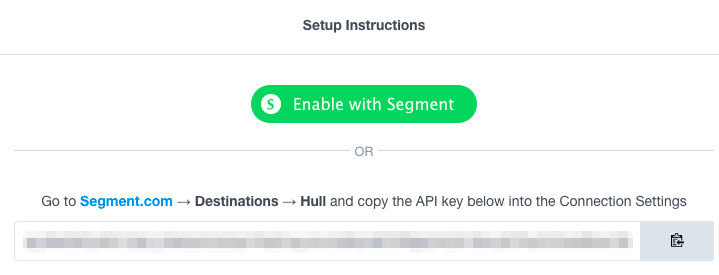
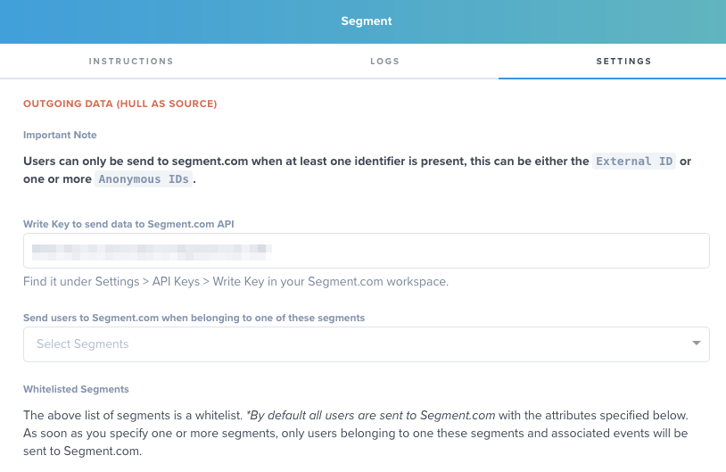
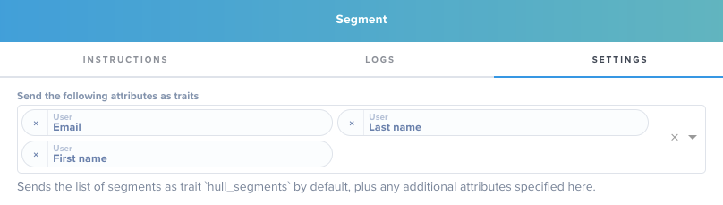
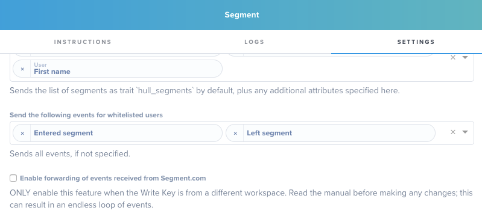
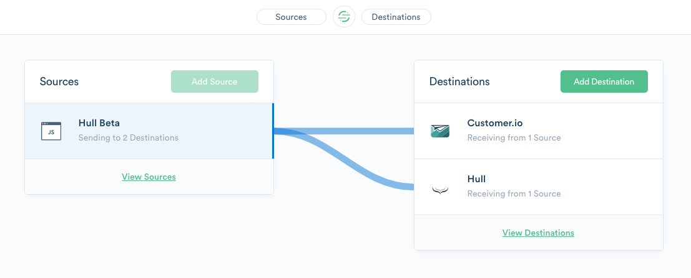
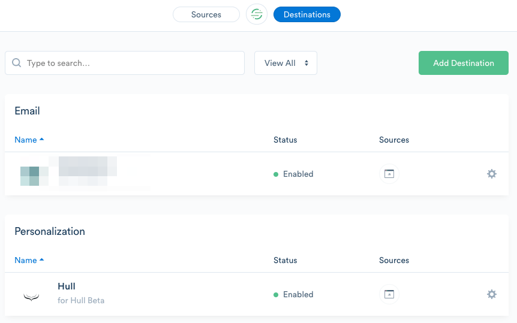
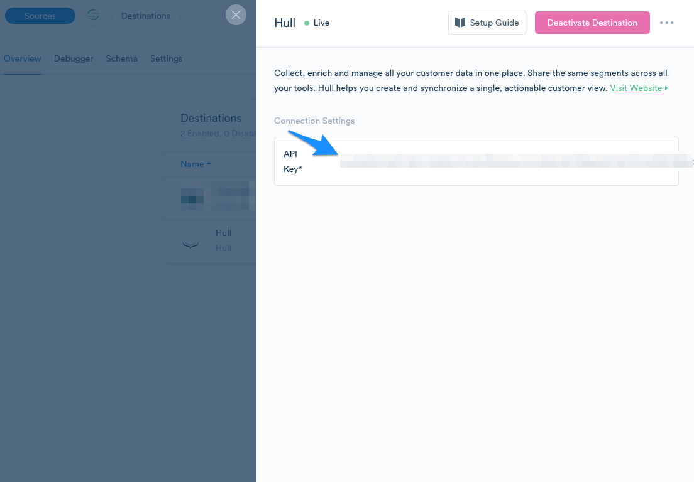
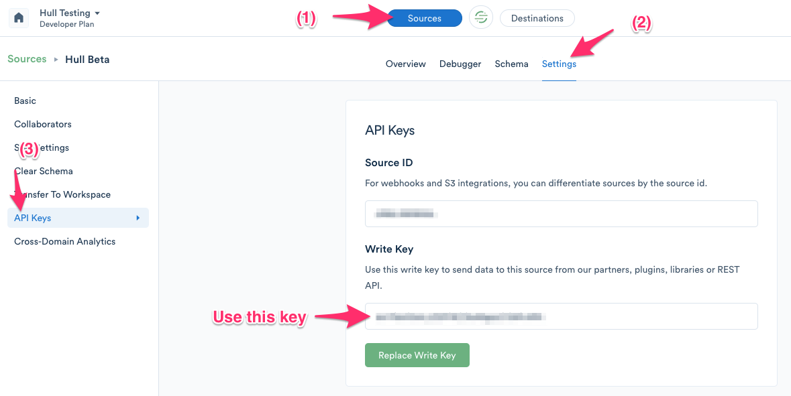

# Segment Connector

The Segment Connector enables your team to send and receive user profiles and events with your Segment integrations and track anonymous page visitors.

## Getting Started

Go to the Connectors page of your Hull organization, click the button “Add Connector” and click “Install” on the Segment card. After installation, stay on the “Dashboard” tab to grant the Connector access to your Segment workspace. You can use the automatic authorization flow by clicking on the button “Enable with Segment” or manually register Hull as a destination in Segment by following the steps described in [Manually Setup Hull as Destination in Segment](#Manually-Setup-Hull-as-Destination-in-Segment).

After you have completed the setup of Hull as a destination, move to the tab “Settings” and complete the configuration of the Connector.
The first decision you have to make is whether you want to configure Hull as a Source in the particular Segment workspace. Enter the Write Key obtained from segment to make Hull a Source or skip this step (see [How to obtain the Write Key from Segment?](#How-to-obtain-the-Write-Key-from-Segment) for details).

Continue your configuration by specifying what data Segment shall receive from Hull as Source by following the steps in the following sections:

- [Specify the Users who are getting send to Segment](#Specify-the-Users-who-are-getting-send-to-Segment)
- [Determine the attributes to send to Segment](#Determine-the-attributes-to-send-to-Segment-%28Hull-as-Source%29)
- [Determine the events to send to Segment](#Determine-the-events-to-send-to-Segment-%28Hull-as-Source%29)

Complete your configuration by determining which events the Connector shall handle except from `identify` calls. Identify calls automatically lead to a creation of a new user in Hull or to an update of an existing one. To learn more about the other events the Segment Connector can handle, read the following sections:

- [Store Page Calls](#Store-Page-Calls)
- [Store Screen Calls](#Store-Screen-Calls)
- [Handle Groups as Accounts](#Handle-Groups-as-Accounts)

## Features

The Hull Segment Connector allows your organization to send and receive data from every customer touch point by connecting Hull with your ecosystem of integrated tools in Segment. This enables your organization to build powerful automated data flows across a broad range of applications and teams, e.g. to personalize emails, fuel analytics, empower your helpdesk or drive attribution.

The Segment connector supports to `create users`, `add traits`, `update traits` and `create events`.

## Specify the Users who are getting send to Segment

The Segment Connector sends and receives events for all users unless you restrict the Connector to send events only for users belonging to specific segments. This segment restriction does only have an effect for outbound data that is sent from Hull to Segment:

## Determine the attributes to send to Segment (Hull as Source)

You can specify the attributes that are getting send to Segment along with each event in the section “Hull as Source” of the “Settings” tab. By default, only the list of segments a user belongs to are send to Segment:

While this setting does not affect your MTU count in Segment, you might want to limit the attributes to the ones the Destinations in Segment can handle. This ensures an efficient data flow with less overhead.

## Determine the events to send to Segment (Hull as Source)

The Segment Connector will send all events by default to Segment, but you can customize this behavior to your needs in the section “Hull as Source” of the “Settings” tab:

Restricting events might be useful when you have a limited set of Destinations in Segment which shall receive only particular events. If you are not sure which events your Destinations can handle, please check the respective documentation or just send all events; Destinations will drop events that they cannot handle.

**Event forwarding**
Note: This section is only relevant if Hull is the Source and Destination in the same Segment workspace.
Let’s explain this setting with a simple example. Assuming you have set up your website “Hull Beta” with analytics.js to track anonymous users and have Hull and Customer.io as Destinations, but use the Write Key in your Segment Connector settings, your workspace in Segment looks like this:

Let’s assume you record a page view with the analytics.js library on your homepage and this call gets send to the workspace. Hull will receive this track call as Destination and updates the related user record. If you have “event forwarding” activated, the Hull Segment Connector would send the event back to the Segment workspace. This essentially duplicates the original event and Hull and Customer.io would receive the same event another time. You probably guess by now where this is going, you would create an endless loop of events in this case.
As a rule of thumb, only use “event forwarding” if you Hull is not Source or Destination in the same segment workspace. As soon as you enter the Write Key into the Segment Connector, make sure that you don’t create an endless loop of events.

## Store Page Calls

Page calls let you record whenever a user sees a page of your website. If you use analytics.js a page call is included in the snippet by default. If you have a single-page application, you have probably instrumented your router component to fire consecutive page calls. If you activate this setting, all page views will be stored in Hull as events on the user.
Storing page calls can lead to a lot of events that impact your pricing.

## Store Screen Calls

Screen calls let you record whenever a user sees a screen, the equivalent of page calls in your mobile app. If you activate this setting, all screen views will be stored in Hull as events on the user.
Storing screen calls can lead to a lot of events that impact your pricing.

## Handle Groups as Accounts

Hull allows you to store attributes received from a Group call as account attributes; if the account is not present, it will create a new one and link it to the user. The Connector uses the `groupId` as unique identifier to determine whether an account exists or not.
In Segment a user can be in multiple groups in segment, however Hull *will handle only one group*. This means, Hull will handle only one linked account, hence consecutive group calls result in the fact that the user will be associated with the account from the last call. If you have multiple groups, you should not activate this feature.

## Manually set up Hull as Destination in Segment

You can either use the automated flow as described in the [Getting Started](#Getting-Started) section or manually configure Hull as a Destination. Start by copying the API key from the Dashboard of the Segment Connector:

Switch to your Segment workspace and add Hull as Destination, if you haven’t done so already:

Select the Hull Destination and paste the API key obtained from Hull in the field shown below:

## How to obtain the Write Key from Segment

You can obtain the write key from your segment workspace, by clicking on Sources (1), selecting one source from the list and clicking on Settings (2) of that source. Select API Keys (3) from the menu on the left-side of your screen and copy the Write Key:
