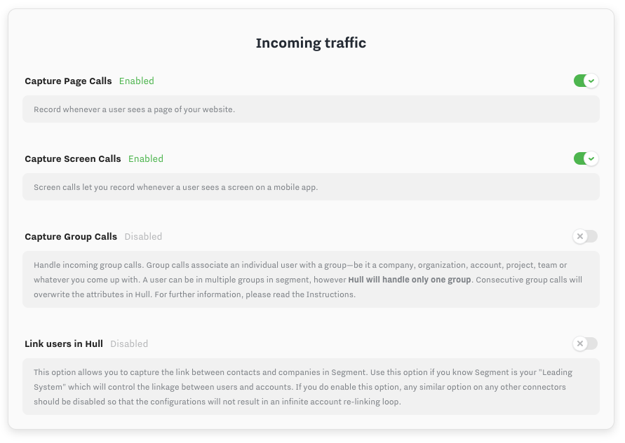
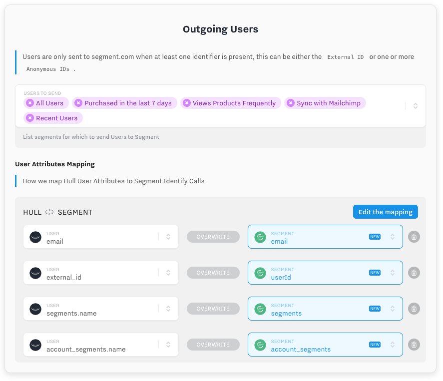
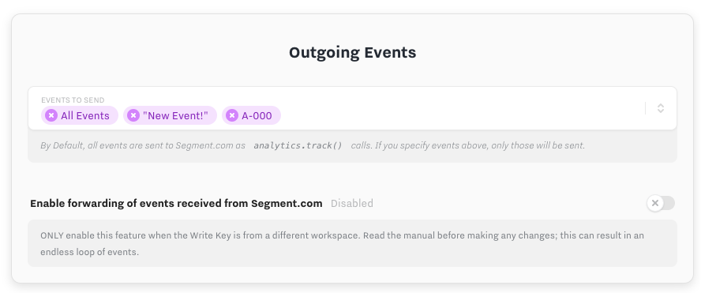
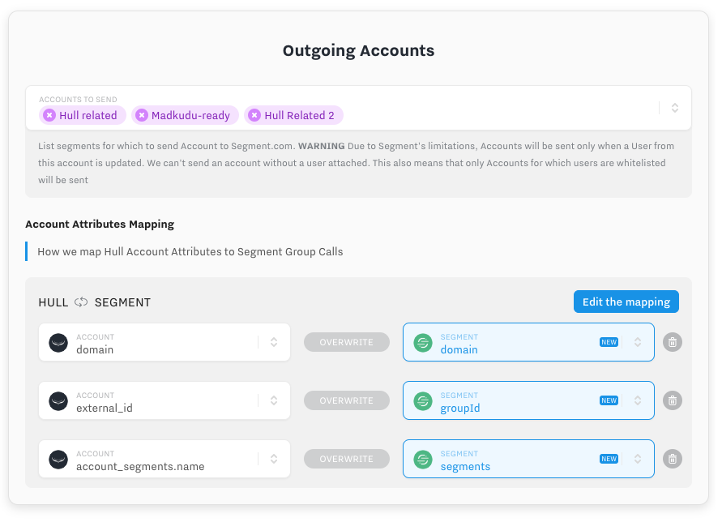

The Segment Connector enables your team to send `users`, `accounts` and `events` to Segment Destinations as well as capture `identify`, `track`, `page`, `screen` and `group` calls from Segment Sources.

## Getting Started

Go to the Connectors page of your Hull organization, click the button “Add Connector” and click “Install” on the Segment card.

After installation, go to the Settings tab, and follow the instructions in the **Credentials** section

After you have completed the setup of Hull as a source and/or a destination, carry on with the configuration of the Connector.

## Incoming traffic: Capturing Data from Segment

The next section allows you to define which types of data must be captured. By default, every page, screen call will be captured.

### Store Page Calls

Page calls let you record whenever a user sees a page of your website. If you use analytics.js a page call is included in the snippet by default. If you have a single-page application, you have probably instrumented your router component to fire consecutive page calls. If you activate this setting, all page views will be stored in Hull as events on the user.
Storing page calls can lead to a lot of events that impact your pricing.

### Store Screen Calls

Screen calls let you record whenever a user sees a screen, the equivalent of page calls in your mobile app. If you activate this setting, all screen views will be stored in Hull as events on the user.
Storing screen calls can lead to a lot of events that impact your pricing.

### Handle Groups as Accounts

Hull allows you to store attributes received from a Group call as account attributes; if the account is not present, it will create a new one and link it to the user. The Connector uses the `groupId` as unique identifier to determine whether an account exists or not.
In Segment a user can be in multiple groups in segment, however Hull *will handle only one group*. This means, Hull will handle only one linked account, hence consecutive group calls result in the fact that the user will be associated with the account from the last call. If you have multiple groups, you should not activate this feature.

If you activate Group calls capture, the next option `Link users in Hull` will define what should be done when a Group call comes in.

- If `Link users in Hull` is disabled, then only the Group attributes will be collected.
- If it's **enabled**, then the associated UserId from Segment will be linked to the GroupId and the target Hull User will be linked to the target Hull Account. This is desirable if Segment is a source of reliable User-Group associations.

> WARNING: You should only activate Link Users in Hull if your business logic **associates users to only ONE account**. If a user can be associated to multiple Group IDs, **you should NOT activate this option** since every Group call will re-parent the Hull User to the Hull Account identified by the latest Group ID. This would result in unreliable User/Account relationships that would switch based on the latest incoming data.

## Outgoing Users: Sending Users to Segment

This section lets you define how Hull Users will be sent to segment.

The first setting defines which users will be sent. By default, ALL users will be sent, but you can easily select one or more of the User segments you defined in Hull as Filters. If you do, DO NOT FORGET to remove the `All Users` entry since all the entries in this box are used to define the whitelist.

The _User Attributes Mapping_ setting lets you define which attributes are sent in Identify calls. Since most tools can't capture everything that Hull stores, this section lets you define with precision which attributes to send. By default, we emit the Email, Segment names as `hull_segments` and Account segment names as `hull_account_segments`. You can easily add your own mappings to this list.

While this setting does not affect your MTU count in Segment, you might want to limit the attributes to the ones the Destinations in Segment can handle. This ensures an efficient data flow with less overhead.

## Outgoing Events: Sending Events to Segment

This section lets you define how Hull Events will be sent to Segment.

From here, you can decide which Events will be sent to Segment. Note that those events will be sent only for Users who match the whitelist defined above. Events belonging to other users will be ignored.

Events called `page` or `screen` will be sent as such to segment, other events will be sent as `track` calls.

By default, we don't forward events we received from Segment, to avoid unintended infinite loops. You can decide to enable this if you have a valid reason to.

#####  Here's an example of a potentially dangerous setup:
> Note: This section is only relevant if Hull is the Source and Destination in the same Segment workspace.

Let’s explain this setting with a simple example. Assuming you have set up your website “Hull Beta” with analytics.js to track anonymous users and have Hull and Customer.io as Destinations, but use the Write Key in your Segment Connector settings, your workspace in Segment looks like this:
Let’s assume you record a page view with the analytics.js library on your homepage and this call gets send to the workspace. Hull will receive this track call as Destination and updates the related user record. If you have “event forwarding” activated, the Hull Segment Connector would send the event back to the Segment workspace. This essentially duplicates the original event and Hull and Customer.io would receive the same event another time. You probably guess by now where this is going, you would create an endless loop of events in this case.
As a rule of thumb, only use “event forwarding” if you Hull is not Source or Destination in the same segment workspace. As soon as you enter the Write Key into the Segment Connector, make sure that you don’t create an endless loop of events.

## Outgoing Accounts: Sending Accounts to Segment

This section lets you define how Hull Accounts will be sent to Segment.

The first field lets you define a whitelist of Accounts that should be sent as `group` calls. Note that due to restrictions from Segment's product, we CANNOT send an account that doesn't have a UserId attached. Which means that the Account update mechanism relies on User Updates. This means that only accounts for whitelisted Users will be sent. If you don't see an Account being updated, it might then be:

- Because the Account isn't part of the Account whitelist
- Because the Account doesn't have any users attached
- Because none of the Account's Users are part of the User whitelist
- Because none of the Account's Users have been updated (this shouldn't happen since any update to the Account will update it's Users in turn)

The second field lets you define the mappings between Hull Account Attributes and segment `group` calls.
By default, we send the domain, and the Account's segments as `hull_segments`
