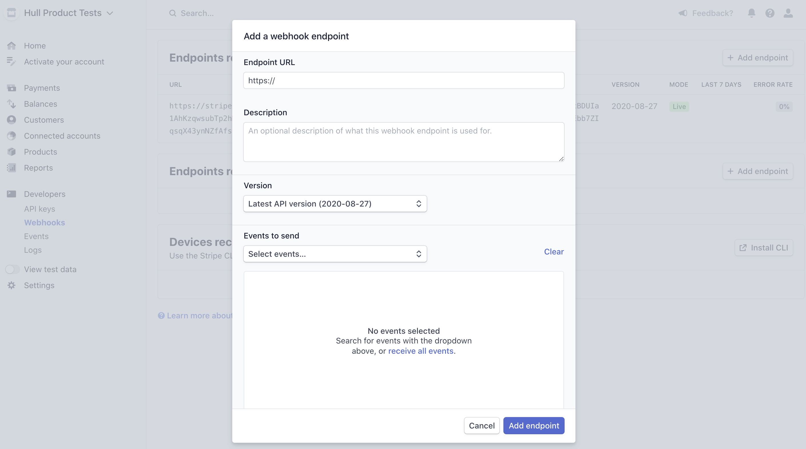
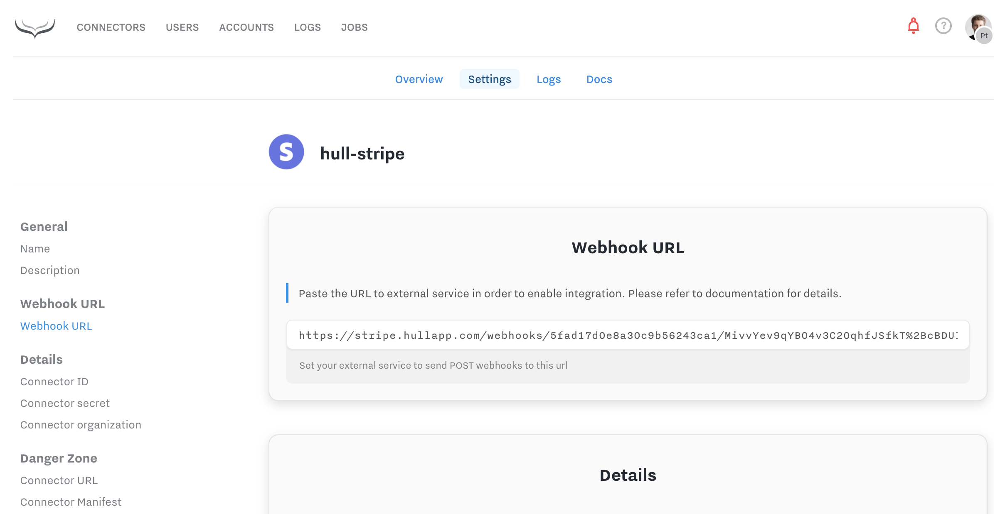

# Stripe

This connector captures Stripe charges, invoice and subscription events and adds them to your Hull User profiles as Events.
It also handles Customer profile updates and captures them as Hull User Attributes.

We use the `email` field to reconcile transactions.

## Getting Started

In order to install the Connector go to the settings pane and copy the webhook url:

With the webhook url in the clipboard, go now to your Stripe instance and head to `Developers > Webhooks` section.
Click `+ Add endpoint` in the top section called "Endpoints receiving events from your account".
This will open up following modal:

Fill in the modal with the webhook url copies from connector settings and select all relevant event types the connector should receive.
The full list of supported events, and how they are stored in Hull see Reference blow.

## Reference

Stripe event types mapping:

| Stripe Event Name               | Hull Event Name           |
| ------------------------------- | ------------------------- |
| `charge.failed`                 | Charge failed             |
| `charge.succeeded`              | Charge succeeded          |
| `charge.refunded`               | Charge Refunded           |
| `invoice.payment_failed`        | Invoice Payment Failed    |
| `invoice.payment_succeeded`     | Invoice Payment Succeeded |
| `invoice.upcoming`              | Invoice Upcoming          |
| `invoice.updated`               | Invoice Updated           |
| `invoice.created`               | Invoice Created           |
| `customer.subscription.updated` | Subscription Updated      |
| `customer.subscription.created` | Subscription Created      |
| `customer.subscription.deleted` | Subscription Ended        |

Latest Stripe API Version connector was tested against: `2020-08-27`
