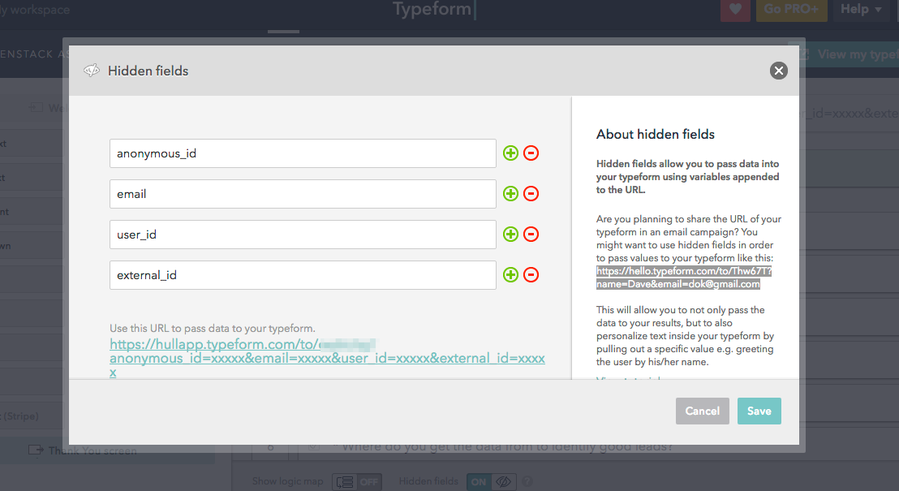

# Typeform integration

## Authorization

After connector installation click "Workspace" button and then "Continue with Typeform".
This will trigger an oAuth authorization flow. You will be redirected to your Typeform
account with information about requested permissions. Pay attention to the information
which Typeform account will be linked, if needed use "Choose a different account." to switch
to the correct one.
Click "Accept" - you will be redirected back to Hull dashboard.

## Configuration

When connector is successfully authorized please go to settings tab and select
the form you want to fetch using the dropdown field.

### User Identification

There are two ways of identifying user fetched into Hull.
First is to use one of the fields from the form as email address.
To use it go to the connector settings and pick an email field from the dropdown.
(Only email type fields are selectable).

Other option to reconcile user identities is to setup your Typeform's to embed [Hidden Fields](https://www.typeform.com/help/hidden-fields/). We recognize the following fields automatically:

- `anonymous_id` - The User's anonymous ID. Use this to reconcile to anonymous web traffic.
- `external_id` - The User's Id in your own database
- `hull_id` - The User's Hull Id
- `email` - The user's email

To enable this, don't forget to enable Hidden fields as follows in your Form:

To configure hidden fields, click on the URL that appears as the topmost box in the `Build` tab of Typeform
