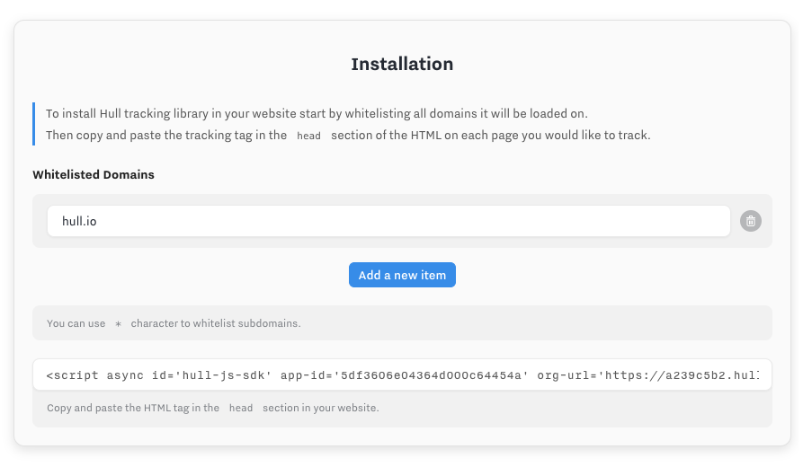
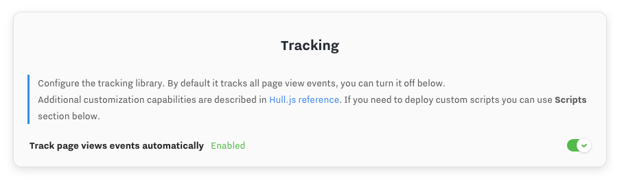
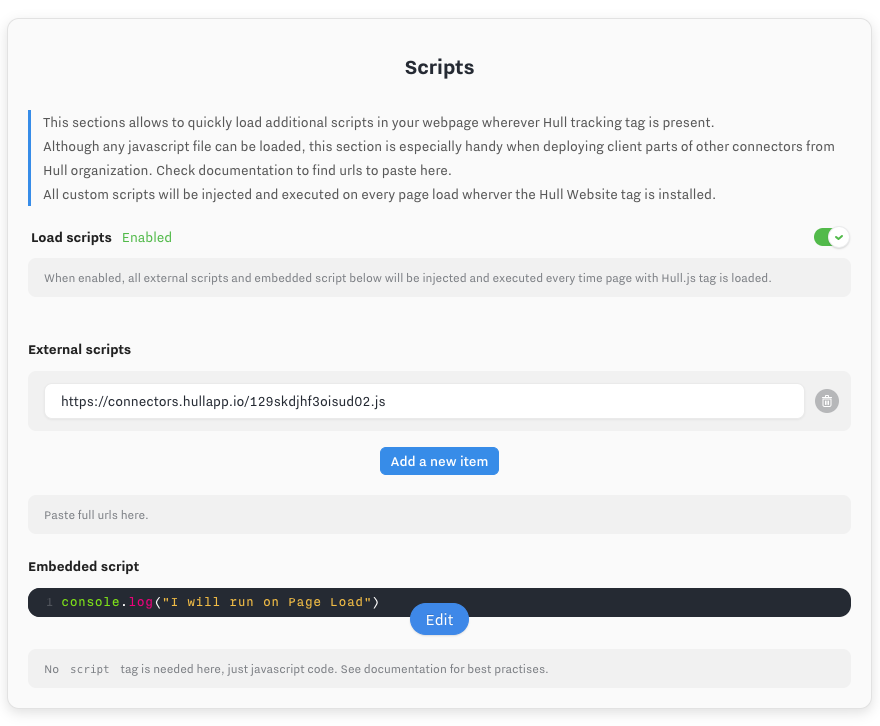

# Website connector

The website connector makes it easy to send your website data to Hull and any connected tool using the Hull.js library.
It allows to track the website traffic and merge it with data coming from other services.

# Installation

This connector integrates with a website through a single HTML tag which then lets you control it's behaviour entirely from the Settings section.

1. First, go to the settings pane and whitelist the domains you would like to authorize and get data from.

> Note: You can use the wildcard entry to whitelist all subdomains of specific domain.
  **Example:** whitelisting `*.website.com` will whitelist `en.website.com`, `de.website.com`, `fr.website.com`... etc.

2. Then, copy the HTML tag show below the whitelist and paste it in the `<head>` section of your website.
You may need to refer to your website system to know how to embed the code, but below we provide guides for common systems.



> Note: If you are using Google Tag Manager, make sure to checkout the Guide on [how to set up Hull.js with Google Tag Manager](https://www.hull.io/docs/guides/getting-started/setting-up-hull-js-with-google-tag-manager/)


# Tracking

Tracking of web traffic is performed by Hull.js. To learn more about how it works, checkout the [Hull.js
 Guide](https://www.hull.io/docs/guides/getting-started/getting-started-hull-js/).

By default this connector provides automatic tracking of page view events and default identity resolution.

Automatic Page tracking can be disabled in the settings of the Website connector and replace by your own custom tracking which can be implemented through additional javscript code deployed to the website.

Further customization capabilities are described at length in the [Hull.js reference](https://www.hull.io/docs/reference/hull_js/).



# Embedded and External Scripts

To make the customization easier the connector comes with support for `Embedded Scripts` and `External Scripts`, allowing you to quickly and easily deploy additional javascript code.

- `External Scripts` let you load additional code libraries without having to edit your website. Hull will load them asynchronously, without blocking the page. This is also the recommended way of deploying client-side parts of other connectors to integrate with external services not only on the back-end but also on the front-end.

- `Embedded Script` let you quickly deploy code to the website Hull connector is installed in. This allows to adjust the tracking plan without constant updates to the website.



### Client-side connectors

Some connector for specific services such as Intercom can also have a Client-side component that you should inject using the Embedded Scripts feature, to establish some connection between Hull and the service. Here is a list of the supported Client-side connectors:

| connector | url |
| --- | --- |
| intercom | https://hull-intercom.herokuapp.com/ship.js |


## Best practises

Deploying javascript code to a website when using Hull connector is easy, but it's important to keep in mind some best practises to avoid problems with front-end code.

**Wrap code in self-executing functions**

It's very easy to pollute website global namespace which leads to risk of overwriting existing variables and function names.
We recommend you wrap every custom code deployed to website with self-executing or self-invoking function.

```js
// BAD: not wrapped code, pollutes global namespace
var foo = 'Hello';

// GOOD: wrapped function, no risk of collision
(function() {
  var foo = 'Hello';
})();
```
