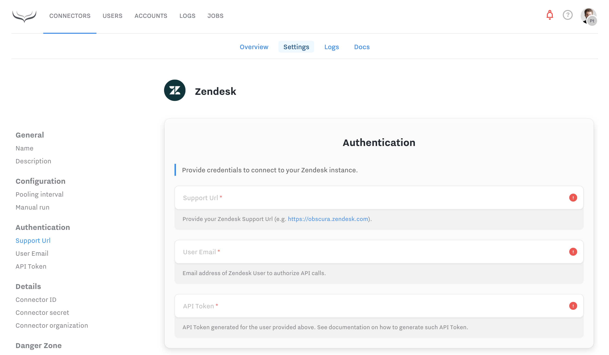
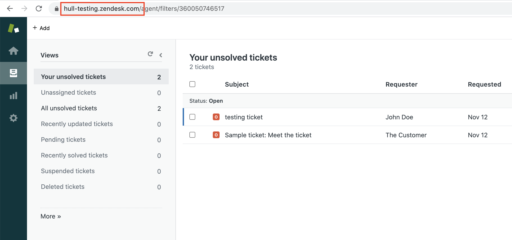
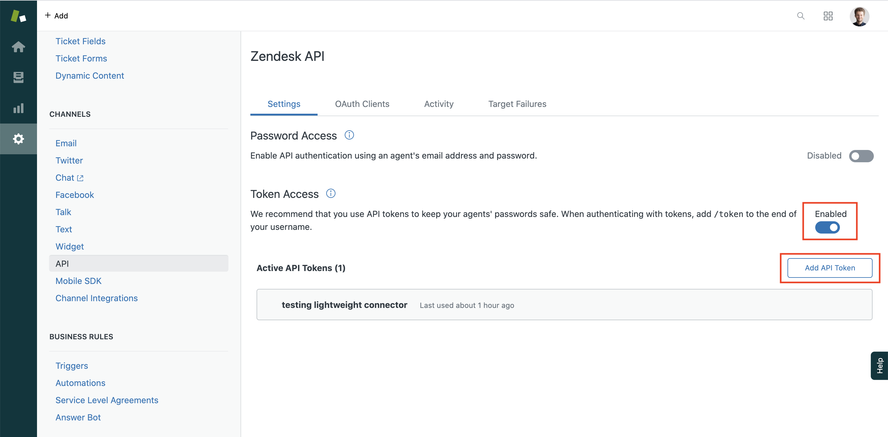
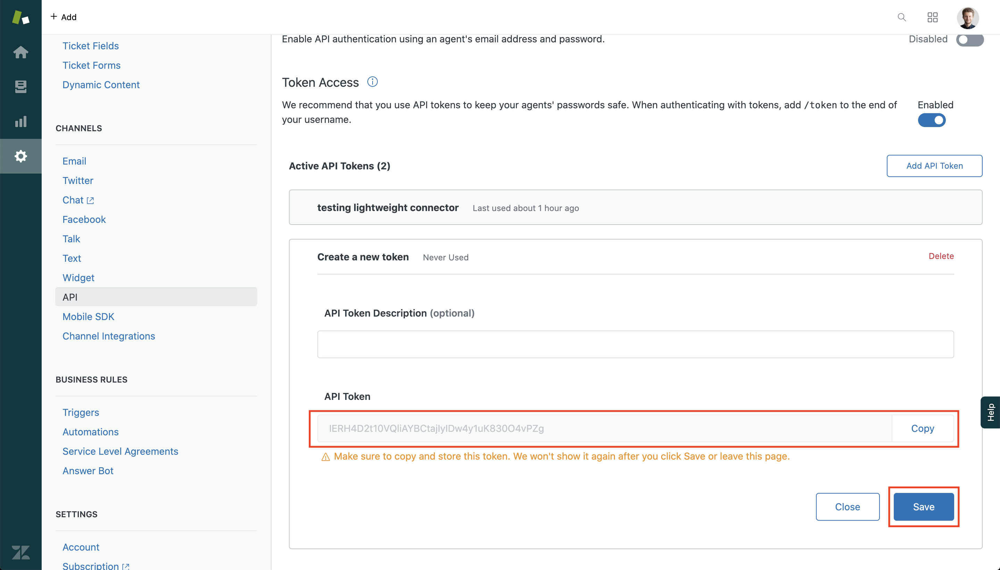

# Zendesk

This connector captures Zendesk tickets and adds them to your Hull User profiles as Hull Events.

## Getting Started

Connector authorize against specific Zendesk Account API as one of the Agents.
Following steps will help you obtain and setup required credentials.

1. Go to your Zendesk account, copy Support URL from location bar and paste it in the connector settings. The url must start with `https://`.
   
2. Enable API Token access by going to "Admin" section in Zendesk. Then find "CHANNELS" section and API.
3. Turn on "Enable Token Access" toggle and create new API Token:
   
4. Give the new API Token meaningful name (it is only meant for you Hull Connector) and copy the token itself.
   
5. Type in your email address and Paste the token in connector settings. Then save the settings.
